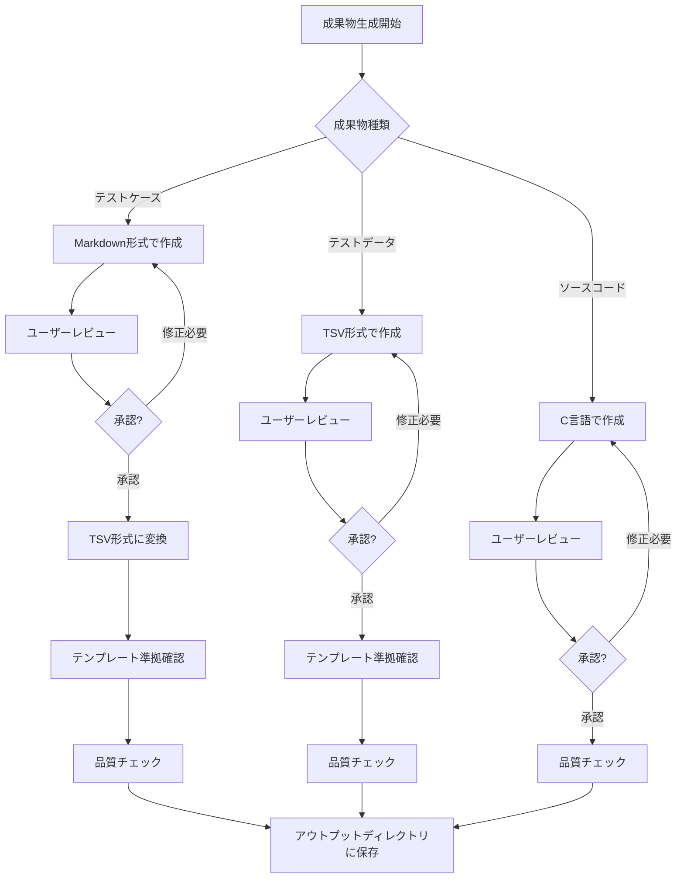

# 成果物形式の標準化ルール

## 概要

本ルールは、C言語製作パッケージにおける成果物の出力形式を標準化し、品質の一貫性を確保するために定められています。

## 絶対遵守ルール

### 1. 成果物の出力先ディレクトリ

**すべての成果物は `アウトプット/` ディレクトリ配下に出力すること。**

- **出力先**: `アウトプット/` ディレクトリ配下
- **適用対象**:
  - テストケース（TSV形式）
  - テストデータ（TSV形式）
  - ソースコード（C言語）
  - プログラム指示書（Markdown形式）
  - その他すべての最終成果物
- **禁止事項**:
  - `アウトプット/` 以外のディレクトリへの成果物出力
  - ワークスペースルート直下への成果物配置
  - `インプット/` ディレクトリへの成果物配置

**配置例**:
```
アウトプット/
  ├── {PGM_ID}_テストケース.tsv
  ├── {PGM_ID}_テストデータ/
  │   ├── IN01.tsv
  │   └── OUT01.tsv
  ├── {PGM_ID}.h
  ├── {PGM_ID}.c
  └── {PGM_ID}_プログラム指示書.md
```

### 2. 成果物の出力形式

#### テストケース

- **形式**: TSV（タブ区切り）形式
- **テンプレート**:
  - `成果物テンプレート/`配下のテストケーステンプレート（TSV形式）
- **成果物**: 単体テストケース生成時は、以下の2つのファイルを作成すること
  - `{PGM_ID}_テストケース.tsv`: 詳細なテストケース
- **ファイル名規約**: `{PGM_ID}_テストケース.tsv`
- **テンプレート参照必須**: 単体テストケース生成時は、必ず成果物テンプレートを参照すること
- **禁止事項**: Markdown形式での最終成果物提出

**補足:**
- **議論・レビュー段階**: Markdown形式での提示は許可
- **最終成果物**: 必ずTSV形式に変換して提出

#### テストデータ

- **形式**: TSV（タブ区切り）形式
- **テンプレート**: `成果物テンプレート/`配下のテストデータテンプレート（TSV形式）
- **配置ルール**: `アウトプット/{PGM_ID}_テストデータ/` ディレクトリ配下に配置
- **ファイル名規約**:
  - 入力データ: `{ファイル名}.tsv` (例: `IN01.tsv`, `IN02.tsv`)
  - 出力データ: `{ファイル名}.tsv` (例: `OUT01.tsv`, `OUT02.tsv`)
- **分離原則**: 入力データと出力データを別ファイルで管理
- **テンプレート参照必須**: 単体テストデータ生成時は、必ず成果物テンプレートを参照すること

#### ソースコード

- **形式**: C言語ソースファイル（`.c`）およびヘッダファイル（`.h`）
- **生成単位**:
  - **`.h` ファイル（必須）**: 変数定義部。インクルードガード、ヘッダファイルインクルード、マクロ定義・定数定義、構造体定義、関数プロトタイプ宣言を含む
  - **`.c` ファイル（必須）**: 関数実装部。先頭に `#include "{PGM_ID}.h"` を記述し、main関数・共通関数・サブ関数の実装を含む
- **ファイル名規約**:
  - ヘッダファイル（変数定義部）: `{PGM_ID}.h`
  - ソースコード（関数実装部）: `{PGM_ID}.c`
- **テンプレート参照必須**: ソースコード生成時は、必ず `プロンプトテンプレート/ソースコード/` 配下のテンプレートを参照すること
- **プログラム指示書への忠実性**: 指示書に記載されていない処理ステップを追加・変更しないこと
- **禁止事項**: テンプレートを使用せずに直接ソースコードを生成すること

## ワークフロー

### 成果物生成フロー



## 成果物提出前チェックリスト

### 成果物形式確認

- [ ] テストケースはTSV形式で作成したか
- [ ] テストデータはTSV形式で作成したか
- [ ] テストデータは `アウトプット/{PGM_ID}_テストデータ/` 配下に配置したか
- [ ] ヘッダファイル（`.h`）を `アウトプット/` 配下に配置したか（変数定義部は必須）
- [ ] ソースコード（`.c`）は `アウトプット/` 配下に配置したか
- [ ] `.c` ファイル冒頭に `#include "{PGM_ID}.h"` が記述されているか
- [ ] テンプレートの形式に従っているか
- [ ] ファイル名は規約に従っているか
- [ ] 入力データと出力データは分離されているか
- [ ] プログラム指示書の処理内容をすべて実装しているか（追加・変更・省略がないか）

### 品質確認

- [ ] セルフチェックリストで検証したか
- [ ] テストケースIDは一貫しているか
- [ ] すべての必須項目が記入されているか
- [ ] 参考資産の形式と整合性があるか

## 違反時の対応

### ルール違反の検出

以下の場合、ルール違反として扱われます：

1. テストケース、テストデータをMarkdown形式で提出した
2. テンプレート形式に従わない独自形式で提出した
3. 入力データと出力データを同一ファイルに混在させた
4. テストデータを `アウトプット/{PGM_ID}_テストデータ/` 配下に配置していない

### 対応手順

1. **即座に作業を中断**
2. **ルールに従った方法で再実行**
3. **成果物を正しい形式で再生成**
4. **チェックリストで再確認**

## 参考資料

### 関連ドキュメント

- [AGENTS.md](../../AGENTS.md): プロジェクト概要

### プロンプトテンプレート

- [`プロンプトテンプレート/単体テストケース/`](../../プロンプトテンプレート/単体テストケース/): テストケース生成用
- [`プロンプトテンプレート/単体テストデータ/`](../../プロンプトテンプレート/単体テストデータ/): テストデータ生成用
- [`プロンプトテンプレート/ソースコード/`](../../プロンプトテンプレート/ソースコード/): ソースコード生成用
