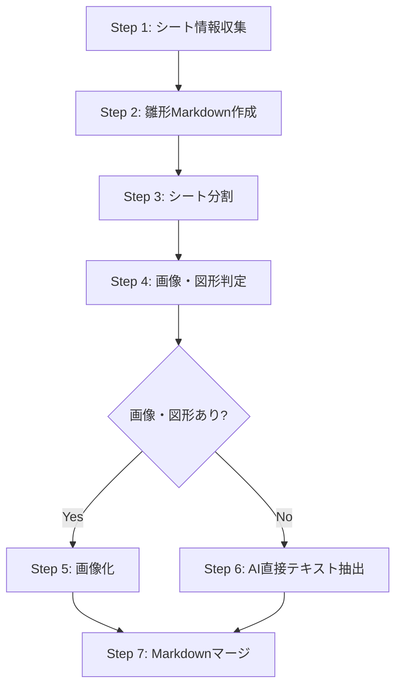

# Excel to Markdown Converter

## 概要

ExcelファイルをMarkdown形式に変換するスキルです。各シートに画像や図形が含まれているかを自動判定し、適切な形式で出力します。設計規約、ファイル定義書、チェックリストなどのExcelファイルをMarkdown形式で配布・保存する際に使用します。

## 使用タイミング

以下のいずれかに該当する場合、このスキルを使用してください：

1. **ExcelファイルをMarkdown形式に変換したい**
2. **設計規約・仕様書をMarkdown形式で保存したい**
3. **複数シートを含むExcelファイルを一括変換したい**
4. **画像を含むシートと文字のみのシートを自動判別して処理したい**

## 引数の扱い

- **引数あり**: 指定されたExcelファイルのみを変換
- **引数なし**: プロジェクト内のすべてのExcelファイル（`.xlsx`, `.xls`）を自動検出して変換
  - 既に `.md` ファイルが存在するExcelファイルはスキップ
  - 変換対象ファイルをリストアップしてユーザーに確認を求める

## 遵守事項

- `read_file` の前に必ず `list_files` で存在確認する
- Excelファイルはサイズが大きいため、パスの参照で済む場合は中身は読まない
- 引数なしの場合、まずプロジェクト全体でExcelファイルを検索し、変換対象をリストアップする

## 処理フロー概要



## Step 1: シート情報収集

### 1.1 Excelファイルの確認

#### 引数ありの場合

指定されたExcelファイルの存在を確認します：

- `list_files`ツールを使用してファイルの存在を確認

#### 引数なしの場合

プロジェクト全体でExcelファイルを検索し、変換対象をリストアップします：

1. プロジェクト全体でExcelファイルを再帰的に検索
   - `list_files`ツールで `.xlsx` と `.xls` ファイルを検索
   - 対象ディレクトリ: `インプット/`, `セルフチェックリスト/`, `参考資産/`, その他プロジェクト内の全ディレクトリ

2. 各Excelファイルに対して、同名の`.md`ファイルが存在するかチェック
   - 例: `sample.xlsx` → `sample.md` が存在するか確認

3. 変換対象ファイルをリストアップ
   - 既に`.md`ファイルが存在するものは除外
   - 変換対象ファイルのリストをユーザーに提示

4. ユーザーに確認を求める
   - "以下のExcelファイルを変換します。よろしいですか？"
   - ファイル1
   - ファイル2
   - ...

5. ユーザーが承認したら、各ファイルに対してStep 1.2以降を実行

### 1.2 変換スクリプトの実行

`excel_to_markdown_with_images.py`スクリプトを使用して、シート情報を収集します：

```bash
python .bob/skills/excel-to-md/scripts/excel_to_markdown_with_images.py <Excelファイルパス> [出力Markdownファイルパス] [DPI]
```

**パラメータ**:
- `Excelファイルパス`: 変換対象のExcelファイル（必須）
- `出力Markdownファイルパス`: 出力先のMarkdownファイル（省略時はExcelファイルと同じディレクトリに `<Excelファイル名>.md` を自動生成）
- `DPI`: 画像変換時の解像度（デフォルト: 250）

**配置ルール**:
- 雛形Markdownファイルと最終的なMarkdownファイルは、生成元のExcelファイルと同じディレクトリに配置すること
- 中間ファイルは `<Excelファイル名>_work/` ディレクトリに格納し、その `_work` ディレクトリを生成元のExcelファイルと同じディレクトリに配置すること
- 出力先を明示的に指定する場合も、特別な理由がない限り生成元のExcelファイルと同じディレクトリを指定すること

**処理内容**:
- Excelファイルを読み込み、全シート名を取得
- シート情報をJSONファイルに保存

## Step 2: 雛形Markdown作成

スクリプトが自動的に、シート名をh2セクションとした雛形Markdownファイルを作成します。

## Step 3: シート分割

スクリプトが自動的に、Excelファイルを1シートずつ別々のファイルに分けます（`<Excelファイル名>_work/sheets/` 配下）。

## Step 4: 画像・図形判定

スクリプトが自動的に、各ファイルに画像や図形が含まれているかを判定します。

## Step 5: 画像化（画像・図形ありシート）

図形・画像のあるExcelファイルは、スクリプトが自動的に `.bob/skills/xlsx-to-images/scripts/excel_to_images.py` を使用して画像化します。

### 生成ファイルの確認

変換後、生成されたファイルを確認します：

- `list_files`ツールを使用して生成ファイルを確認
- 生成元のExcelファイルと同じディレクトリに以下が生成される：
  - `<Excelファイル名>.md`: 雛形Markdownファイル
  - `<Excelファイル名>_work/`: 作業ディレクトリ
    - `sheet_info.json`: シート情報
    - `sheets/`: 分割されたシートファイル
    - `<シート名>_images/`: 画像・図形ありシートの画像ディレクトリ

## Step 6: AI直接テキスト抽出（画像・図形なしシート）

### 6.1 シート情報の確認

`sheet_info.json`を読み込んで、画像・図形なしシート（`has_images: false`）を特定します：

- `read_file`ツールで`sheet_info.json`を読み込む

### 6.2 Excelファイルからの直接テキスト抽出

画像・図形なしシートごとに、以下の処理を実行します：

1. **分割Excelファイルの読み込み**
   - `read_file`ツールで分割Excelファイルを読み込む
   - 対象: `<Excelファイル名>_work/sheets/<シート名>.xlsx`
   - `sheet_info.json`で `has_images: false` のシート

2. **Excelからテキスト抽出**
   - Excelファイルに表示されているテキストを**忠実に**読み取る
   - 適切なMarkdown形式に変換（表、箇条書き、見出しなど）
   - 抽出したコンテンツを一時ファイルに保存

3. **抽出ファイルの作成**
   - `write_to_file`ツールで抽出コンテンツを保存
   - ファイル名: `<Excelファイル名>_work/<シート名>_extracted.md`
   - ※ `<Excelファイル名>_work/` は生成元のExcelファイルと同じディレクトリ

**重要な注意事項**:
- 読み取れない内容は推測しない
- 不明箇所は `[読み取り不可]` と明記
- 確実に読み取れた情報のみを記載
- 表構造はMarkdownテーブル形式で再現
- 見出しは適切なレベル（h3以下）で記述

### 6.3 抽出例

**元のExcel内容**:
```
目次
1. コード規約 ........... 3
2. SQL規約 ............. 15
3. 改定履歴 ............ 25
```

**抽出Markdown** (`目次_extracted.md`):
```markdown
### 目次

| 章 | タイトル | ページ |
|:---|:---|:---|
| 1 | コード規約 | 3 |
| 2 | SQL規約 | 15 |
| 3 | 改定履歴 | 25 |
```

## Step 7: Markdownマージ

### 7.1 画像・図形ありシートのマージ

画像・図形ありシートについて、画像参照を雛形にマージします：

```bash
python .bob/skills/excel-to-md/scripts/merge_markdown.py <雛形Markdownファイル> <シート名> <画像参照Markdown>
```

**画像参照Markdown例**:
```markdown

```

### 7.2 画像・図形なしシートのマージ

各画像・図形なしシートについて、抽出したMarkdownを雛形にマージします：

```bash
python .bob/skills/excel-to-md/scripts/merge_markdown.py <雛形Markdownファイル> <シート名> <抽出Markdownファイル>
```

**パラメータ**:
- `雛形Markdownファイル`: Step 1で生成した雛形Markdown
- `シート名`: マージ対象のシート名
- `抽出Markdownファイル`: Step 2で作成した抽出Markdown

**例**:
```bash
python .bob/skills/excel-to-md/scripts/merge_markdown.py "インプット/コーディング規約.md" "目次" "インプット/コーディング規約_work/目次_extracted.md"
```

### 7.3 最終確認

すべてのシートをマージ後、最終的なMarkdownファイルを確認します：

- `read_file`ツールで最終Markdownを確認

## 出力ファイル構造

```
インプット/
├── コーディング規約.xlsx
├── コーディング規約.md          # 最終的なMarkdownファイル
└── コーディング規約_work/        # 作業ディレクトリ
    ├── sheet_info.json                # シート情報
    ├── sheets/                        # 分割されたシートファイル
    │   ├── 表紙.xlsx
    │   ├── 目次.xlsx
    │   └── ...
    ├── 表紙_images/                   # 画像・図形ありシートの画像
    │   └── page_001.png
    ├── 1.コード_images/
    │   ├── page_001.png
    │   └── page_002.png
    └── ...
```

## 最終出力形式の例

```markdown
# コーディング規約

## 表紙


## 目次

### 目次

| 章 | タイトル | ページ |
|:---|:---|:---|
| 1 | コード規約 | 3 |
| 2 | SQL規約 | 15 |
| 3 | 改定履歴 | 25 |

## 1.コード


## 2.SQL


## 改定履歴


```

## 使用例

### 全Excelファイルを一括変換（引数なし）

スキルを引数なしで実行すると、プロジェクト内のすべてのExcelファイルを自動検出して変換します：

```
処理の流れ:
1. プロジェクト全体でExcelファイル（.xlsx, .xls）を検索
2. 既に.mdファイルが存在するものを除外
3. 変換対象ファイルをリストアップしてユーザーに確認
4. 承認後、各ファイルに対してStep 1-7を実行
```

### 特定のExcelファイルを変換（引数あり）

```bash
# Step 1-5: シート情報収集、雛形作成、シート分割、画像・図形判定、画像化
python .bob/skills/excel-to-md/scripts/excel_to_markdown_with_images.py インプット/コーディング規約.xlsx

# Step 6: AI直接テキスト抽出（AIが実施）
# - sheet_info.jsonを確認
# - 画像・図形なしシートの分割Excelファイルを読み込み
# - Excelから直接テキストを抽出してMarkdownを作成

# Step 7: マージ
# - 各シートの抽出Markdownをマージ
```

### 出力先を指定する場合

```bash
# Step 1-5
# 出力先は生成元Excelと同じディレクトリ配下を指定する
python .bob/skills/excel-to-md/scripts/excel_to_markdown_with_images.py "インプット/コーディング規約.xlsx" "インプット/規約.md"

# Step 6-7は同様
```

### 高解像度で変換する場合

```bash
# Step 1-5
# 高解像度指定時も出力先は生成元Excelと同じディレクトリにする
python .bob/skills/excel-to-md/scripts/excel_to_markdown_with_images.py "インプット/コーディング規約.xlsx" "インプット/規約.md" 400

# Step 6-7は同様
```

## 機能

- **自動シート判定**: 画像・図形の有無を自動判定
- **シート分割**: 各シートを別ファイルとして保存
- **シート別処理**: 各シートに最適な変換方法を適用
- **高品質画像変換**: DPI指定による高品質な画像生成
- **AI直接テキスト抽出**: 画像・図形なしシートはAIがExcelから直接テキスト抽出
- **Markdown構造化**: シート名をh2セクションとして構造化
- **作業ファイル保持**: 分割Excel、画像ファイルを保持して再利用可能

## 品質チェックリスト

変換完了後、以下を確認してください：

### Step 1-5完了時
- [ ] すべてのシート名が取得されているか
- [ ] 雛形Markdownにすべてのシートセクションが含まれているか
- [ ] すべてのシートが分割されているか
- [ ] すべてのシートの画像・図形有無が判定されているか
- [ ] 画像・図形ありシートが画像化されているか
- [ ] sheet_info.jsonが正しく生成されているか

### Step 6完了時
- [ ] すべての画像・図形なしシートを処理したか
- [ ] Excelから直接テキストが抽出されているか
- [ ] 表構造が適切に再現されているか
- [ ] 見出しレベルが適切か
- [ ] 読み取れない箇所を明示しているか

### Step 7完了時
- [ ] すべての抽出Markdownがマージされているか
- [ ] 画像参照のパスが正しいか
- [ ] 最終Markdownが読みやすいか

## 注意事項

1. **7段階プロセスの遵守**: 必ず7段階のプロセスに従うこと
2. **シート種別の判定**: 画像・図形の有無を正確に判定すること
3. **変換方法の分離**:
   - 画像・図形ありシート: `excel_to_images.py`で画像化
   - 画像・図形なしシート: AIがExcelから直接テキスト抽出
4. **生成先ディレクトリの統一**: 雛形Markdownと最終Markdownは生成元のExcelファイルと同じディレクトリに配置し、中間ファイルはその配下ではなく、同じ階層に配置した `<Excelファイル名>_work/` ディレクトリに格納すること
5. **テキスト抽出時の推測禁止**: 読み取れない内容は絶対に推測しないこと
6. **不明箇所の明示**: 不鮮明な箇所は `[読み取り不可]` と明記すること
7. **確実性の優先**: 不確実な情報よりも、確実に読み取れた情報のみを記載すること
8. **作業ファイルの保持**: 作業ディレクトリ（分割Excel、画像、JSON）は削除せず保持すること
9. **表構造の再現**: 表はMarkdownテーブル形式で忠実に再現すること

## 必要なパッケージ

- `xlwings`: Excelファイルの操作とシート分割
- `PyMuPDF (fitz)`: PDFファイルの読み込みと画像変換（excel_to_images.pyで使用）

インストール:
```bash
pip install xlwings PyMuPDF
```

## 制限事項

- Windowsでのみ動作します（Microsoft Excelが必要）
- シート名に使用できない文字（`/`, `\`, `:`）は自動的に`_`に置換されます
- 非常に大きなシート（複数ページ）は画像が複数生成されます
- マクロや複雑な書式は変換時に簡略化される場合があります

## トラブルシューティング

### エラー: `No module named 'xlwings'`

```bash
pip install xlwings
```

### エラー: `No module named 'fitz'`

```bash
pip install PyMuPDF
```

### エラー: `Excelが起動しません`

Microsoft Excelがインストールされているか確認してください。

### 画像が不鮮明な場合

DPI値を上げて再変換してください：

```bash
python .bob/skills/excel-to-md/scripts/excel_to_markdown_with_images.py <Excelファイル> <出力先> 400
```

または、`excel_to_images.py`のパラメータを調整してください：

```bash
python .bob/skills/xlsx-to-images/scripts/excel_to_images.py <Excelファイル> --dpi 400 --font-size 14
```

### マージが失敗する場合

1. 雛形Markdownファイルが存在するか確認
2. シート名が正確か確認（大文字・小文字、スペースも含めて完全一致）
3. 抽出Markdownファイルが存在するか確認

## 関連ドキュメント

- [scripts/README.md](scripts/README.md): スクリプト詳細ドキュメント
- [.bob/skills/xlsx-to-images/SKILL.md](../xlsx-to-images/SKILL.md): Excel→画像変換スキル
- [.bob/skills/xlsx-to-images/scripts/excel_to_images.py](../xlsx-to-images/scripts/excel_to_images.py): Excel→画像変換スクリプト

## 関連スキル

- **xlsx-to-images**: ExcelファイルをPNG画像に変換（本スキル内で使用）
