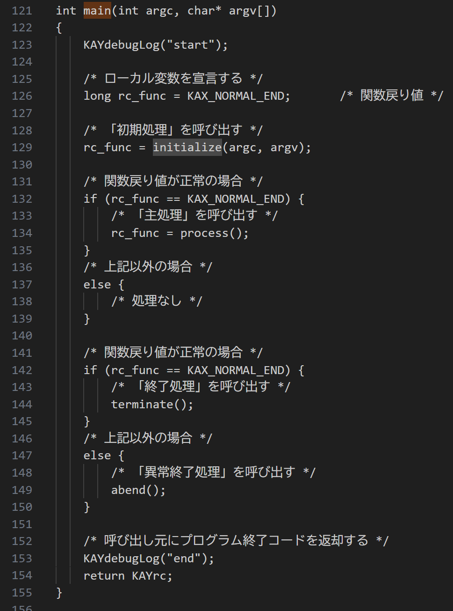

# コード生成用プロンプトテンプレート

## 更新情報

| バージョン | 日付 | 内容 |
| :--- | :--- | :--- |
| v0.01.00 | 2025/07/25 | 新規作成 |
| v1.00.00 | 2025/08/22 | ソースコード生成機能の本番リリースのためv1.00.00に更新。 |
| v2.00.00 | 2025/11/11 | 既存のプロンプトをSystemPromptとUserPromptに分割。|
| v3.00.00 | 2026/03/16 | SQL部分も同時に生成するために、プロンプト変数に `{db_call}` を追加。 |


## 生成対象



## プロンプトテンプレートに当てはめる値の抜粋条件

| 変数 | 抜粋条件 |
|:-----------|:------------|
| input_process | 詳細処理説明書から、生成対象の処理説明を関数単位（初期処理、主処理、終了処理など）で入力する。 |
| db_call | DB CALL処理セクションの全量を入力する。プログラム自体にDB CALL処理が登場しない場合は何も入力しない。 |

### input_process の入力例

```(txt)
### main
- パラメータ： int argc, char* argv[]
- 戻り値： KAY_OK
- 型： int
1. KAYdebugLog("start")を実行
2. ローカル変数rc_funcをKAX_NORMAL_ENDで初期化
3. initialize(argc, argv)を呼び出し、結果をrc_funcに代入
4. rc_funcがKAX_NORMAL_ENDの場合
    1. process()を呼び出し、結果をrc_funcに代入
5. rc_funcがKAX_NORMAL_ENDの場合
    1. terminate()を呼び出す
6. rc_funcがKAX_NORMAL_ENDでない場合
    1. abend()を呼び出す
7. KAYdebugLog("end")を実行
8. KAYrcを返却
```

### db_call の入力例

~~~
## DB CALL処理

### PS1A122_40
#### initCS100WWVESP
```yaml
詳細処理対応No: 1
テーブル名: "CS100WWVESP"
命令: DELETE
SQL操作項目: []
SQL抽出条件: []
```

#### insertCS100WWVESP
```yaml
詳細処理対応No: 2
テーブル名: "CS100WWVESP"
命令: INSERT
SQL操作項目: [
    "CCMPCD = :S1ZCmpCdStr",
    "CPLCD = :S1ZPlCdStr",
    "CURN = :pSpec->cURN",
    "CIDLN = :pSpec->cIDLn",
    "CPSC = :pSpec->cPSC",
    "CEDNO = :pSpec->cEDNo",
    "CSSNO = :pSpec->cSSNo",
    "CCTRKT = :pSpec->cCtrkt",
    "CICCL = :pSpec->cICCl",
    "CECCL = :pSpec->cECCl",
    "CSPEC = :pSpec->cSpec",
    "CCFC = :pSpec->cCfc",
    "CDSTCD = SUBSTR(:pSpec->cDstCd, 1, 3)",
    "CPACSTYCD = :pSpec->cPacstyCd",
    "CUNMD = :pSpec->cUnMd",
    "CCARYLIN = :pSpec->cCaryLin",
    "CCARYVETP = :pSpec->cCaryVetp",
    "CLOPLDAT = :pSpec->cLopldat",
    "COPTOFMD = :pSpec->cOptOfMd",
    "CEXPCUS = :pSpec->cExpCus",
    "CPRPLMK = :pSpec->cPrplMk",
    "CORDCY = :pSpec->cOrdCy",
    "CSYUPDAT = :pSpec->cSyupdat",
    "CREGUSR = :S1ZPrgIdStr",
    "TREGTIM = SYSTIMESTAMP",
    "COLUPDUSR = :S1ZPrgIdStr",
    "CBTUPDUSR = :S1ZPrgIdStr",
    "TOLUPDTIM = SYSTIMESTAMP",
    "TBTUPDTIM = SYSTIMESTAMP"
]
SQL抽出条件: []
```

#### insertCS100WVESPE
```yaml
詳細処理対応No: 3
テーブル名: "CS100WVESPE"
命令: DELETE
SQL操作項目: []
SQL抽出条件: [
    "CCMPCD = :S1ZCmpCdStr",
    "AND CPLCD = :S1ZPlCdStr",
    "AND CPRPLMK = :PROPCD_MONTHLY"
]
```

```yaml
詳細処理対応No: 4
テーブル名: "CS100WVESPE W127"
命令: DELETE
SQL操作項目: []
SQL抽出条件: [
    "W127.CCMPCD = :S1ZCmpCdStr",
    "AND W127.CPLCD = :S1ZPlCdStr",
    "AND EXISTS (SELECT 1 FROM CS100WWVESP W132 WHERE W132.CCMPCD = W127.CCMPCD AND W132.CPLCD = W127.CPLCD AND W132.CURN = W127.CURN AND W132.CIDLN = W127.CIDLN)"
]
```

```yaml
詳細処理対応No: 5
テーブル名: "CS100WVESPE W127"
命令: INSERT
SQL操作項目: [
    "W127.CCMPCD = W132.CCMPCD",
    "W127.CPLCD = W132.CPLCD",
    "W127.CURN = W132.CURN",
    "W127.CIDLN = W132.CIDLN",
    "W127.CPSC = W132.CPSC",
    "W127.CEDNO = W132.CEDNO",
    "W127.CSSNO = W132.CSSNO",
    "W127.CCTRKT = W132.CCTRKT",
    "W127.CICCL = W132.CICCL",
    "W127.CECCL = W132.CECCL",
    "W127.CSPEC = W132.CSPEC",
    "W127.CCFC = W132.CCFC",
    "W127.CDSTCD = W132.CDSTCD",
    "W127.CPACSTYCD = W132.CPACSTYCD",
    "W127.CUNMD = W132.CUNMD",
    "W127.CCARYLIN = W132.CCARYLIN",
    "W127.CCARYVETP = W132.CCARYVETP",
    "W127.CLOPLDAT = W132.CLOPLDAT",
    "W127.COPTOFMD = W132.COPTOFMD",
    "W127.CEXPCUS = W132.CEXPCUS",
    "W127.CPRPLMK = W132.CPRPLMK",
    "W127.CORDCY = W132.CORDCY",
    "W127.CSYUPDAT = W132.CSYUPDAT",
    "W127.CREGUSR = :S1ZPrgIdStr",
    "W127.TREGTIM = SYSTIMESTAMP",
    "W127.COLUPDUSR = :S1ZPrgIdStr",
    "W127.CBTUPDUSR = :S1ZPrgIdStr",
    "W127.TOLUPDTIM = SYSTIMESTAMP",
    "W127.TBTUPDTIM = SYSTIMESTAMP"
]

テーブル名: "CS100WWVESP W132"
命令: SELECT
SQL操作項目: [
    "W132.CCMPCD",
    "W132.CPLCD",
    "W132.CURN",
    "W132.CIDLN",
    "W132.CPSC",
    "W132.CEDNO",
    "W132.CSSNO",
    "W132.CCTRKT",
    "W132.CICCL",
    "W132.CECCL",
    "W132.CSPEC",
    "W132.CCFC",
    "W132.CDSTCD",
    "W132.CPACSTYCD",
    "W132.CUNMD",
    "W132.CCARYLIN",
    "W132.CCARYVETP",
    "W132.CLOPLDAT",
    "W132.COPTOFMD",
    "W132.CEXPCUS",
    "W132.CPRPLMK",
    "W132.CORDCY",
    "W132.CSYUPDAT"
]
SQL抽出条件: [
    "W132.CCMPCD = :S1ZCmpCdStr",
    "AND W132.CPLCD = :S1ZPlCdStr"
]
```
~~~

## 生成結果のチェック観点

- <\/c>または'''まで出力されているか。

### 注意事項
- 関数内で呼び出される別の関数のプロトタイプ宣言やグローバル変数、マクロ(define文)等が生成される可能性があります（先の生成物例参照）。
- マクロ名がヘッダファイルで既に定義されている物の場合、生成結果から削除してください。
- プロトタイプ宣言された関数が同じCプログラム内で宣言される関数の場合、生成結果から削除してください。
## 生成例

実プロンプト・生成結果は、[こちら](https://t365cs.sharepoint.com/:f:/r/sites/Guest-Tms-1147/Shared%20Documents/%E7%B6%AD%E6%8C%81%E3%83%BB%E6%94%B9%E5%96%84%E3%83%81%E3%83%BC%E3%83%A0/06_%E3%83%97%E3%83%AD%E3%83%B3%E3%83%97%E3%83%88%E6%94%B9%E5%96%84/%E3%83%97%E3%83%AD%E3%83%B3%E3%83%97%E3%83%88%E5%AE%9F%E8%A1%8C%E7%B5%90%E6%9E%9C/C/%E3%83%97%E3%83%AD%E3%82%B0%E3%83%A9%E3%83%A0%E4%BB%95%E6%A7%98%E6%9B%B8/%E3%82%B3%E3%83%BC%E3%83%89%E7%94%9F%E6%88%90?csf=1&web=1&e=79NUta)に格納している。

```(txt)
#include <stdio.h>

// 定義されていない関数やマクロの宣言（仮）
void KAYdebugLog(const char *message);
#define KAY_OK 0
#define KAX_NORMAL_END 0
int initialize(int argc, char* argv[]);
int process();
void terminate();
void abend();
int KAYrc;

int main(int argc, char* argv[]) {
    KAYdebugLog("start");
    int rc_func = KAX_NORMAL_END;
    rc_func = initialize(argc, argv);
    if (rc_func == KAX_NORMAL_END) {
        rc_func = process();
    }
    if (rc_func == KAX_NORMAL_END) {
        terminate();
    } else {
        abend();
    }
    KAYdebugLog("end");
    return KAYrc;
}
```
