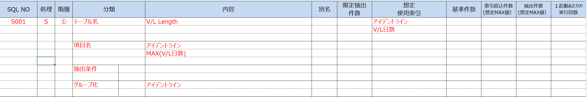

# DB CALL処理生成用プロンプトテンプレート

## 更新情報

| バージョン | 日付 | 内容 |
| :--- | :--- | :--- |
| v0.01.00 | 2025/07/25 | 新規作成 |
| v1.00.00 | 2025/08/22 | プログラム指示書生成機能の本番リリースのためv1.00.00に更新。 |
| 02.00.00 | 2025/11/11 | 既存のプロンプトをSystemPromptとUserPromptに分割。|

## 生成対象



## プロンプトテンプレートに当てはめる値の抜粋条件

| 変数 | 抜粋条件 |
|:-----------|:------------|
| exec_sql | EXEC SQL SELECT,UPDATE,DELETE,INSERT,FETCH句を入力する。 |

### exeq_sql の入力例

```(txt)
/* DB検索(cubm101lanesub) */
EXEC SQL
    SELECT A.LANENO
            ,A.LANESUBNO
            ,B.LANEKBN
            ,B.LOC_CTL_KBN
    INTO   :sLaneNoWk
            ,:iLaneSubNoWk
            ,:sLaneKbnWk
            ,:sLocCtlKbnWk
    FROM   CUBM101LANESUB A,
            CUBM100LANE B
    WHERE  A.HANCD       = B.HANCD
    AND    A.LANENO      = B.LANENO
    AND    A.HANCD       = :UBsHanCd
    AND    A.FRMKBNNO_YI = :sFrmKbnNoWk
    FETCH FIRST 1 ROWS ONLY
;

/*--------------------------------------------------------*/
/* DB削除(cubm535instldaddr)                              */
/*--------------------------------------------------------*/
EXEC SQL
    DELETE
    FROM   CUBM535INSTLDADDR
    WHERE  HANCD         = :sHanCdWk
    AND    VESSELCODE    = :sVesselCodeWk
    AND    DEPARTUREDATE = :sDepartureDateWk
    AND    DESTGRPNO     = :lDestGrpNoWk
    AND    LANENO        = :sLanenoWk
    AND    FRMKBNNO      = :sFrmKbnNoWk
;

/*--------------------------------------------------------*/
/* DB更新(cubm101lanesub)                                 */
/*--------------------------------------------------------*/
EXEC SQL
    UPDATE CUBM101LANESUB
    SET    VHCUNIQINFO_YI     = ' '
            ,FRMKBNNO_YI        = ' '
            ,YARDUTILPLANNO_YI  = 0
            ,YARDUTILPLANDNO_YI = 0
            ,HANNYUSAKIGRPNO_YI = 0
            ,HANNYUSAKICD_YI    = ' '
            ,OGTTERM_YI         = ' '
            ,CRRYING_DATETIME   = ' '
            ,TOKUTEI_FLG        = '0'
            ,VHCUNIQINFO_OD     = ' '
            ,FRMKBNNO_OD        = ' '
            ,YARDUTILPLANNO_OD  = 0
            ,YARDUTILPLANDNO_OD = 0
            ,HANNYUSAKIGRPNO_OD = 0
            ,HANNYUSAKICD_OD    = ' '
            ,OGTTERM_OD         = ' '
            ,YARD_SKINO_KBN     = ' '
            ,YARD_SDATETIME     = ' '
            ,UPDDATETIME        = current_timestamp
            ,UPDUID             = :UBsUserId
    WHERE  HANCD              = :sHanCdWk
    AND    LANENO             = :sLaneNoWk
;

/*--------------------------------------------------------*/
/* DB新設(cubm506troubleinfo)                             */
/*--------------------------------------------------------*/
EXEC SQL
    INSERT INTO CUBM506TROUBLEINFO
            (HANCD
            , TROUBLENO
            , TROUBLEKBN
            , DISPKBN
            , TROUBLETXT
            , UPDDATETIME
            , UPDUID
            , INSERTDATETIME
            , INSERTUID)
    VALUES(:sHanCdWk
            , SUBM013.NEXTVAL
            , '1'
            , '1'
            , :sErrMsgWk
            , current_timestamp
            , :UBsUserId
            , current_timestamp
            , :UBsUserId)
;
```

## 生成結果のチェック観点

- 出力例の形式で出ているか。
- </yaml>まで出力されているか。

### 注意事項

- Inputの量が多い場合、生成物の精度が下がる（SQL操作項目の変数/定数、SQL抽出条件の変数が省略される等）可能性があります。その場合、生成対象とするInputの分量をEXEC SQL句毎に減らして、再度生成を実行してください。（プロンプト内のソースコードを編集：手順4.5を参照）

## 生成例

実プロンプト・生成結果は、[こちら](https://t365cs.sharepoint.com/:f:/r/sites/Guest-Tms-1147/Shared%20Documents/%E7%B6%AD%E6%8C%81%E3%83%BB%E6%94%B9%E5%96%84%E3%83%81%E3%83%BC%E3%83%A0/06_%E3%83%97%E3%83%AD%E3%83%B3%E3%83%97%E3%83%88%E6%94%B9%E5%96%84/%E3%83%97%E3%83%AD%E3%83%B3%E3%83%97%E3%83%88%E5%AE%9F%E8%A1%8C%E7%B5%90%E6%9E%9C/C/DB%20CALL%E8%A8%98%E8%BF%B0%E6%9B%B8?csf=1&web=1&e=HVW6Db)に格納している。

```(txt)
<yaml>
テーブル名: "CUBM101LANESUB, CUBM100LANE"
命令: SELECT
SQL操作項目: [
    "A.LANENO",
    "A.LANESUBNO",
    "B.LANEKBN",
    "B.LOC_CTL_KBN"
]
SQL抽出条件: [
    "A.HANCD = B.HANCD",
    "AND A.LANENO = B.LANENO",
    "AND A.HANCD = :UBsHanCd",
    "AND A.FRMKBNNO_YI = :sFrmKbnNoWk"
]
その他条件: "FETCH FIRST 1 ROWS ONLY"
</yaml>

<yaml>
テーブル名: "CUBM535INSTLDADDR"
命令: DELETE
SQL操作項目: []
SQL抽出条件: [
    "HANCD = :sHanCdWk",
    "AND VESSELCODE = :sVesselCodeWk",
    "AND DEPARTUREDATE = :sDepartureDateWk",
    "AND DESTGRPNO = :lDestGrpNoWk",
    "AND LANENO = :sLanenoWk",
    "AND FRMKBNNO = :sFrmKbnNoWk"
]
</yaml>

<yaml>
テーブル名: "CUBM101LANESUB"
命令: UPDATE
SQL操作項目: [
    "VHCUNIQINFO_YI = ' '",
    "FRMKBNNO_YI = ' '",
    "YARDUTILPLANNO_YI = 0",
    "YARDUTILPLANDNO_YI = 0",
    "HANNYUSAKIGRPNO_YI = 0",
    "HANNYUSAKICD_YI = ' '",
    "OGTTERM_YI = ' '",
    "CRRYING_DATETIME = ' '",
    "TOKUTEI_FLG = '0'",
    "VHCUNIQINFO_OD = ' '",
    "FRMKBNNO_OD = ' '",
    "YARDUTILPLANNO_OD = 0",
    "YARDUTILPLANDNO_OD = 0",
    "HANNYUSAKIGRPNO_OD = 0",
    "HANNYUSAKICD_OD = ' '",
    "OGTTERM_OD = ' '",
    "YARD_SKINO_KBN = ' '",
    "YARD_SDATETIME = ' '",
    "UPDDATETIME = current_timestamp",
    "UPDUID = :UBsUserId"
]
SQL抽出条件: [
    "HANCD = :sHanCdWk",
    "AND LANENO = :sLaneNoWk"
]
</yaml>

<yaml>
テーブル名: "CUBM506TROUBLEINFO"
命令: INSERT
SQL操作項目: [
    "HANCD = :sHanCdWk",
    "TROUBLENO = SUBM013.NEXTVAL",
    "TROUBLEKBN = '1'",
    "DISPKBN = '1'",
    "TROUBLETXT = :sErrMsgWk",
    "UPDDATETIME = current_timestamp",
    "UPDUID = :UBsUserId",
    "INSERTDATETIME = current_timestamp",
    "INSERTUID = :UBsUserId"
]
SQL抽出条件: []
</yaml>
```
