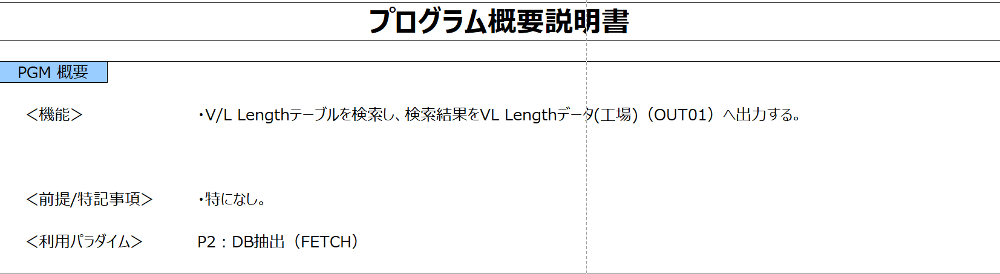

# PGM概要説明書（概要）生成用プロンプトテンプレート

## 更新情報

| バージョン | 日付 | 内容 |
| :--- | :--- | :--- |
| v0.01.00 | 2025/07/25 | 新規作成 |
| v1.00.00 | 2025/08/22 | プログラム指示書生成機能の本番リリースのためv1.00.00に更新。 |
| 02.00.00 | 2025/11/11 | 既存のプロンプトをSystemPromptとUserPromptに分割。|

## 生成対象



## プロンプトテンプレートに当てはめる値の抜粋条件

| 変数 | 抜粋条件 |
|:-----------|:------------|
| code | ソースコードからPGM説明、ファイル/変数定義、main処理、初期処理、主処理、終了処理を抜粋して入力する。 |

### code の入力例

```(txt)
/*
 * Project name : G-ALC
 * Paradigm     : P2:DB抽出(FETCH)
 * Program ID   : PKAE204
 * Process Name : VL Lengthデータ作成(工場)
 * Author       : TISA)T.Yokotani
 * Create Date  : 2021/07/06
 * Version    Modified date  Name            Details
 * 01.00.00   2021/07/06     TISA)T.Yokotani 新規作成
 *
 * Functions
 *  Funciton name :  Description
 *  main                : main処理
 *  initialize          : 初期処理
 *  process             : 主処理
 *  terminate           : 終了処理
 *  abend               : 異常終了処理
 *  readIn01            : 入力データ読込(IN01)
 *  setKey01            : 抽出条件設定(TBL01)
 *  openCsr01           : 検索カーソルオープン(TBL01)
 *  fetchCsr01          : 検索カーソルフェッチ(TBL01)
 *  closeCsr01          : 検索カーソルクローズ(TBL01)
 *  setOut01            : データ移送(OUT01)
 * Copyright(C) 2022- TOYOTA Motor Corporation. All Rights Reserved.
*/

/*------------------------------------------------------------*/
/* ヘッダーファイル定義                                       */
/*------------------------------------------------------------*/
#include <stdlib.h>
#include <string.h>
#include <stdio.h>
EXEC SQL INCLUDE SQLCA;
#include "PKAY500.h"

/* ###### アプリ ヘッダー定義 Start               ######[P2.01S]Ver.1.0.0 */
#include "PKAE204.h"
#include "DKAY900.h"
#include "DKAY901.h"
#include "DKAY902.h"
#include "DKAE01040102.h"
#include "CZD04MSGTBL.h"
#include "CKA01M0720.h"
/* ###### アプリ ヘッダー定義 End                 ######[P2.01E]Ver.1.0.0 */

/*------------------------------------------------------------*/
/* グローバル変数定義                                         */
/*------------------------------------------------------------*/

/* GSCMFWコンテキスト構造体 */
static PZS1111_CTX  KAYctx;

/* プログラム終了コード(正常時) */
static int  KAYrc = KAY_OK;

/* 入力データファイル用変数 */
static char KAYpsc    [LEN_KA_PSC     + 1];         /* PSC                     */
static char KAYplant  [LEN_KA_PLANT   + 1];         /* 工場コード              */
static char KAYjparam [LEN_KA_JPARAM  + 1];         /* JOB内ユニークパラメータ */

/* メッセージ付加情報 */
static char KAYaddInfo[LEN_KA_ADDINFO + 1];

/* ###### アプリ 変数定義 Start                   ######[P2.02S]Ver.1.0.0 */

/* Copyright */
static const char copyRight[] = "All Rights Reserved. Copyright 2022 (C) " \
                                "TOYOTA MOTOR CORPORATION.";
/* Version */
static const char src_version[] = "01.00.00";

/* ファイル記述子 */
static FILE *KAYfpIn01  = NULL;
static FILE *KAYfpOut01 = NULL;

/* ファイル構造体 */
static DKAY900        KAYin01;                          /* ファイル構造体(IN01)         */
static DKAE01040102   KAYout01;                         /* ファイル構造体(OUT01)        */


/* テーブル構造体 */
static CKA01M0720 KAYtbl01;                         /* テーブル構造体(TBL01) */

/* ###### アプリ 変数定義 End                     ######[P2.02E]Ver.1.0.0 */

/*
 * Function name : main
 * Description
 *  main処理
 * Parameters
 *  argc (I) : コマンドライン引数の数
 *  argv (I) : コマンドライン引数の配列
 * Return values
 *  KAY_OK   : 正常終了
*/
int main(int argc, char* argv[])
{
    KAYdebugLog("start");
    
    /* 1.「初期処理」を呼び出す。 */
    initialize(argc, argv);
    /* 2.「主処理」を呼び出す。 */
    process();
    /* 3.「終了処理」を呼び出す。 */
    terminate();
    
    /* 4.呼び出し元にプログラム終了コードを返却する。 */
    KAYdebugLog("end");
    return KAYrc;
}

/*
 * Function name : initialize
 * Description
 *  初期処理
 * Parameters
 *  argc (I) : コマンドライン引数の数
 *  argv (I) : コマンドライン引数の配列
 * Return values
 *  N/A
*/
static void initialize(int argc, char* argv[])
{
~~~~~~~（略）~~~~~~~~~~~~~~~~~~~~~~~~~~~~~~~~~~~~~~~~~~~~~~~
}

/*
 * Function name : process
 * Description
 *  主処理
 * Parameters
 *  N/A
 * Return values
 *  N/A
*/
static void process(void)
{
~~~~~~~（略）~~~~~~~~~~~~~~~~~~~~~~~~~~~~~~~~~~~~~~~~~~~~~~~
}

/*
 * Function name : terminate
 * Description
 *  終了処理
 * Parameters
 *  N/A
 * Return values
 *  N/A
*/
static void terminate(void)
{
~~~~~~~（略）~~~~~~~~~~~~~~~~~~~~~~~~~~~~~~~~~~~~~~~~~~~~~~~
}
```

## 生成結果のチェック観点

- 指定した文字数以内で出ているか。

### 注意事項

- インプットに日本語を含むコメント（日本語でのDB名やファイル名、項目名など）が記載されている場合は、生成結果にコメントの内容が反映されます。コメントがない場合は、生成結果に反映されない場合があるため、ご自身で生成結果を修正してください。

## 生成例

実プロンプト・生成結果は、[こちら](https://t365cs.sharepoint.com/:f:/r/sites/Guest-Tms-1147/Shared%20Documents/%E7%B6%AD%E6%8C%81%E3%83%BB%E6%94%B9%E5%96%84%E3%83%81%E3%83%BC%E3%83%A0/06_%E3%83%97%E3%83%AD%E3%83%B3%E3%83%97%E3%83%88%E6%94%B9%E5%96%84/%E3%83%97%E3%83%AD%E3%83%B3%E3%83%97%E3%83%88%E5%AE%9F%E8%A1%8C%E7%B5%90%E6%9E%9C/C/%E3%83%97%E3%83%AD%E3%82%B0%E3%83%A9%E3%83%A0%E6%A6%82%E8%A6%81%E8%AA%AC%E6%98%8E%E6%9B%B8?csf=1&web=1&e=Nf2z7K)に格納している。

```(txt)
OUTPUT : このCプログラムは、VL Lengthデータを作成するためのものです。プログラムは、入力データを読み込み、データベースからVL Lengthデータを抽出し、それを出力ファイルに書き込む処理を行います。具体的には、初期処理でファイルをオープンし、主処理でデータベースからデータを取得して出力ファイルに書き込み、最後に終了処理でファイルをクローズします。
```
