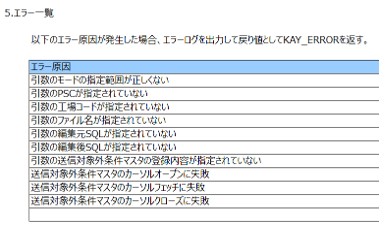

# サブプログラム説明書（エラー一覧）生成用プロンプトテンプレート

## 更新情報

| バージョン | 日付 | 内容 |
| :--- | :--- | :--- |
| v0.01.00 | 2025/07/25 | 新規作成 |
| v1.00.00 | 2025/08/22 | プログラム指示書生成機能の本番リリースのためv1.00.00に更新。 |
| 02.00.00 | 2025/11/11 | 既存のプロンプトをSystemPromptとUserPromptに分割。|

## 生成対象

サブプログラム説明書のうち、エラー一覧部分を生成する。



## プロンプトテンプレートに当てはめる値の抜粋条件

| 変数 | 抜粋条件 |
|:-----------|:------------|
| code | 共通部品などサブプログラムのソースコード全体を入力する。 |

### code の入力例

```(txt)
/*
 * Project name : G-ALC
 * Paradigm     : P2:DB抽出(FETCH)
 * Program ID   : PKAX902
 * Process Name : 送信対象外条件マスタSQL作成
 * Author       : TS)K.Yamashita
 * Create Date  : 2021/09/14
 * Version    Modified date  Name            Details
 * 01.00.00   2021/09/14     TS)K.Yamashita  New Creation
 *
 * Functions
 *  Funciton name :  Description
 *  KAXmakeSqlSendExclusive : 送信対象外条件マスタSQL作成
 *  openCsr99           : 送信対象外条件マスタ検索カーソルオープン
 *  fetchCsr99          : 送信対象外条件マスタ検索カーソルフェッチ(TBL01)
 *  closeCsr99          : 送信対象外条件マスタ検索カーソルクローズ(TBL01)
 *  All Rights Reserved. Copyright 2022 (C) TOYOTA MOTOR CORPORATION.
*/

/*------------------------------------------------------------*/
/* ヘッダーファイル定義                                       */
/*------------------------------------------------------------*/
#include <stdlib.h>
#include <string.h>
#include <stdio.h>
EXEC SQL INCLUDE SQLCA;
#include "PKAY500.h"

/* ###### アプリ ヘッダー定義 Start               ######[P2.01S]Ver.1.0.0 */
#include "PKAY520.h"
#include "DKAY901.h"
#include "DKAY902.h"
#include "PKAY704.h"
#include "PKAX900.h"
#include "PKAX90200.h"
#include "CKA01M1270.h"

/* ###### アプリ ヘッダー定義 End                 ######[P2.01E]Ver.1.0.0 */

/*------------------------------------------------------------*/
/* グローバル変数定義                                         */
/*------------------------------------------------------------*/

/* GSCMFWコンテキスト構造体 */
static PZS1111_CTX  KAYctx;

/* プログラム終了コード(正常時) */
static int  KAYrc = KAY_OK;

/* メッセージ付加情報 */
static char KAYaddInfo[LEN_KA_ADDINFO + 1];

/* ###### アプリ 変数定義 Start                   ######[P2.02S]Ver.1.0.0 */

/* Copyright */
static const char copyRight[] = "All Rights Reserved. Copyright 2022 (C) " \
                                "TOYOTA MOTOR CORPORATION.";
/* Version */
static const char src_version[] = "01.00.00";

/* テーブル構造体 */
static CKA01M1270 KAYtbl01;                         /* 送信対象外条件マスタ */

/* 作成SQL */
static char KAYSqledit[KAX_LEN_SQL + 1];

/* ###### アプリ 変数定義 End                     ######[P2.02E]Ver.1.0.0 */

/*
 * Function name : KAXmakeSqlSendExclusive
 * Description
 *  送信対象外条件マスタSQL作成
 * Parameters
 *  mode      (I) : 送信対象外条件マスタの結果編集モード
 *  psc       (I) : PSC
 *  plantCode (I) : 工場コード
 *  fileName  (I) : ファイル名
 *  srcSql    (I) : 編集元SQL
 *  outSql    (O) : 編集後SQL
 *  condInfo  (O) : 送信対象外条件マスタの登録内容
 * Return values
 *  KAX_NORMAL_END   : 正常終了
 *  KAX_ABNORMAL_END : 異常終了
*/
long KAXmakeSqlSendExclusive(int           mode,
                                    const char   *psc,
                                    const char   *plantCode,
                                    const char   *fileName,
                                    const char   *srcSql,
                                    char         *outSql,
                                    PKAX902_Info *condInfo)
{
    KAYdebugLog("start");
    
/* ###### アプリ 処理記述 Start                   ######[P2.04S]Ver.1.0.0 */

    /* ローカル変数を宣言する。 */
    long   rc_rtn = KAX_NORMAL_END;     /* 関数戻り値 */
    long   rc1 = 0;                     /* 引数チェック結果 */
    long   rc2 = 0;                     /* カーソルオープン結果 */
    long   rc3 = 0;                     /* カーソルフェッチ結果 */
    long   rc4 = 0;                     /* カーソルクローズ結果 */
    long   cnt = 0;                     /* インデックス */
    char   wksql[KAX_LEN_SQL];          /* SQL生成用 */

    /* 変数を初期化する。 */
    memset(KAYSqledit, 0x00, sizeof(KAYSqledit));
    memset(wksql,      0x00, sizeof(wksql));

    /* 引数チェック */
    /* モードが範囲外を指定している場合 */
    if ((mode != KAX_CST_MAKESQL) &&
        (mode != KAX_CST_PUTDETEAL) &&
        (mode != KAX_CST_SQL_AND_DETEAL)) {
        
        /* 戻り値に異常を設定する。 */
        rc1 = KAX_ABNORMAL_END;
    }
    else {
        /* 処理なし */
    }
    
    /* モードによる引数必須指定の判断をする。 */
    /* モードがKAX_CST_MAKESQの場合*/
    if (mode   == KAX_CST_MAKESQL) {
        /* PSC、工場コード、ファイル名、編集元SQL、編集後SQLが設定されていない場合 */
        if ((psc    == NULL) || (plantCode == NULL) || (fileName == NULL) ||
            (srcSql == NULL) || (outSql    == NULL)) {
            
            /* 戻り値に異常を設定する。 */
            rc1 = KAX_ABNORMAL_END;
        }
        /* 上記以外の場合 */
        else {
            /* 作成SQL編集元SQLを編集する */
            strncpy(KAYSqledit, srcSql, strlen(srcSql));
        }
    }
    /* モードがKAX_CST_PUTDETEALの場合で、*/
    else if (mode     == KAX_CST_PUTDETEAL) {
       /* PSC、工場コード、ファイル名、*/
       /* 送信対象外条件マスタの登録内容領域定が設定されていない場合 */
       if ((psc      == NULL) || (plantCode == NULL) ||
           (fileName == NULL) ||(condInfo == NULL)) {
            /* 戻り値に異常を設定する。 */
            rc1 = KAX_ABNORMAL_END;
        }
        else {
            /* 処理なし */
        }
    }
    /* 上記以外の場合(モードがKAX_CST_SQL_AND_DETEALの場合) */
    else {
        /* PSC、工場コード、ファイル名、編集元SQL、編集後SQL */
        /* 送信対象外条件マスタの登録内容領域が設定されていない場合 */
        if ((psc      == NULL) || (plantCode == NULL) || 
            (fileName == NULL) || (srcSql    == NULL) ||
            (outSql   == NULL) || (condInfo  == NULL)) {
            
            /* 戻り値に異常を設定する。 */
            rc1 = KAX_ABNORMAL_END;
        }
        else {
            /* 作成SQL編集元SQLを編集する */
            strncpy(KAYSqledit, srcSql, strlen(srcSql));
        }
    }
    
    /* 引数チェック結果 */
    /* 引数チェック結果が異常の場合 */
    if (rc1 == KAX_ABNORMAL_END) {
        
        /* 戻り値に異常を設定する。 */
        rc_rtn = KAX_ABNORMAL_END;
        rc2    = KAX_ABNORMAL_END;
        rc3    = KAX_ABNORMAL_END;
        rc4    = KAX_ABNORMAL_END;
    }
    else {
        /* 「送信対象外条件マスタ検索カーソルオープン」を呼び出す。 */
        rc2 = openCsr99(psc, plantCode, fileName);
        
        /* 「送信対象外条件マスタ検索カーソルフェッチ」の戻り値が */
        /*  １件の間ループする。 */
        while ((rc3 = fetchCsr99()) == 1) {
            /* 条件-カラム名、 条件-内容をライトトリムする。 */
            KAYtrimR(KAYtbl01.condcolname, strlen(KAYtbl01.condcolname));
            KAYtrimR(KAYtbl01.condcontent, strlen(KAYtbl01.condcontent));
            
            /* モードがSQL作成をする場合 */
            if ((mode == KAX_CST_MAKESQL) ||
                (mode == KAX_CST_SQL_AND_DETEAL)) {
                
                /* SQLの編集をする。 */
                snprintf(wksql, sizeof(wksql), KAX_SQLEDIT9,
                         KAYtbl01.condcolname,
                         KAYtbl01.condposi,
                         KAYtbl01.condleng,
                         KAYtbl01.condcontent);
                
                /* 作成SQLに追記する。 */
                strncat(KAYSqledit, wksql, strlen(wksql));
                
                /* 作成SQLをライトトリムする。 */
                KAYtrimR(KAYSqledit, strlen(KAYSqledit));
            }
            else {
                /* 処理なし */
            }
            
            /* モードが送信対象外条件マスタの詳細情報を編集する場合 */
            if ((mode == KAX_CST_PUTDETEAL) || (mode == KAX_CST_SQL_AND_DETEAL)) {
                
                /* 引数で指定された送信対象外条件マスタの条件-カラム名に */
                /* テーブルから取得した項目を格納する。 */
                strncpy(condInfo->InfoDetail[cnt].condcolname,
                        KAYtbl01.condcolname, LEN_KA_CONDCOLNAME);
                
                /* 引数で指定された送信対象外条件マスタの条件-内容に */
                /* テーブルから取得した項目を格納する。*/
                strncpy(condInfo->InfoDetail[cnt].condcontent,
                        KAYtbl01.condcontent, LEN_KA_CONDCONTENT);
                
                /* 引数で指定された送信対象外条件マスタの条件-桁目、条件-桁数に */
                /* テーブルから取得した項目を格納する。*/
                condInfo->InfoDetail[cnt].condposi = KAYtbl01.condposi;
                condInfo->InfoDetail[cnt].condleng = KAYtbl01.condleng;
                
                /* 格納件数を+1して、*/
                /* 引数で指定された送信対象外条件マスタの格納件数に編集する。*/
                cnt = cnt + 1;
                condInfo->count = cnt;
            }
            else { /* 上記以外の場合(引数がNULL指定) */
                /* 処理なし */
            }
        }
        
        /* 「送信対象外条件マスタ検索カーソルクローズ」を呼び出す。 */
        rc4 = closeCsr99();
    }
    
    /* 送信対象外条件マスタによるSQLが作成された場合 */
    if ((strlen(KAYSqledit)) != 0) {
        /* 引数の編集後SQLにSQLの編集をする。 */
        strncpy(outSql, KAYSqledit, strlen(KAYSqledit));
    }
    else {
        /* 処理なし */
    }
    
    /* 関数戻り値が正常の場合 */
    if ((rc1 == KAX_NORMAL_END)   && (rc2 == KAX_NORMAL_END) &&
        (rc3 == KAY_SQL_NOTFOUND) && (rc4 == KAX_NORMAL_END)) {
        
        /* 戻り値に正常を設定する。 */
        rc_rtn = KAX_NORMAL_END;
    }
    else {
        /* 戻り値に異常を設定する。 */
        rc_rtn = KAX_ABNORMAL_END;
    }

/* ###### アプリ 処理記述 End                     ######[P2.04E]Ver.1.0.0 */
    
    /* 呼び出し元に戻る。 */
    KAYdebugLog("end");
    return rc_rtn;
}
~~~~~~~（略）~~~~~~~~~~~~~~~~~~~~~~~~~~~~~~~~~~~~~~~~~~~~~~~

/* ###### アプリ 関数記述 Start                   ######[P2.11S]Ver.1.0.0 */

/* ###### アプリ 関数記述 End                     ######[P2.11E]Ver.1.0.0 */
```

## 生成結果のチェック観点

- 出力例の形式で出ているか。

### 注意事項


## 生成例

実プロンプト・生成結果は、[こちら](https://t365cs.sharepoint.com/:f:/r/sites/Guest-Tms-1147/Shared%20Documents/%E7%B6%AD%E6%8C%81%E3%83%BB%E6%94%B9%E5%96%84%E3%83%81%E3%83%BC%E3%83%A0/06_%E3%83%97%E3%83%AD%E3%83%B3%E3%83%97%E3%83%88%E6%94%B9%E5%96%84/%E3%83%97%E3%83%AD%E3%83%B3%E3%83%97%E3%83%88%E5%AE%9F%E8%A1%8C%E7%B5%90%E6%9E%9C/C/%E3%82%B5%E3%83%96%E3%83%97%E3%83%AD%E3%82%B0%E3%83%A9%E3%83%A0%20CALL%E8%AA%AC%E6%98%8E%E6%9B%B8?csf=1&web=1&e=QrH1Wo)に格納している。


```(txt)
### KAXmakeSqlSendExclusive
1. モードが範囲外を指定している場合
    - モードが `KAX_CST_MAKESQL`, `KAX_CST_PUTDETEAL`, `KAX_CST_SQL_AND_DETEAL` のいずれでもない場合
2. モードが `KAX_CST_MAKESQL` の場合で、PSC、工場コード、ファイル名、編集元SQL、編集後SQLのいずれかが設定されていない場合
3. モードが `KAX_CST_PUTDETEAL` の場合で、PSC、工場コード、ファイル名、送信対象外条件マスタの登録内容領域が設定されていない場合
4. モードが `KAX_CST_SQL_AND_DETEAL` の場合で、PSC、工場コード、ファイル名、編集元SQL、編集後SQL、送信対象外条件マスタの登録内容領域のいずれかが設定されていない場合
5. 引数チェック結果が異常の場合
6. 「送信対象外条件マスタ検索カーソルオープン」の戻り値が異常の場合
    - `openCsr99` 関数の戻り値が `KAX_ABNORMAL_END` の場合
        - `KAYcheckSql` 関数の戻り値が異常（非0）の場合
7. 「送信対象外条件マスタ検索カーソルフェッチ」の戻り値が異常の場合
    - `fetchCsr99` 関数の戻り値が `-1` の場合
        - `KAYcheckSql` 関数の戻り値が異常（非0）の場合
8. 「送信対象外条件マスタ検索カーソルクローズ」の戻り値が異常の場合
    - `closeCsr99` 関数の戻り値が `KAX_ABNORMAL_END` の場合
        - `KAYcheckSql` 関数の戻り値が異常（非0）の場合
9. 関数戻り値が正常でない場合
    - `rc1`, `rc2`, `rc3`, `rc4` のいずれかが `KAX_NORMAL_END` でない場合
```
