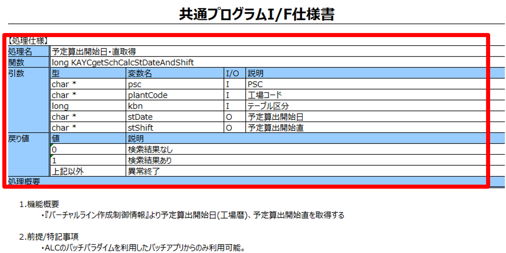
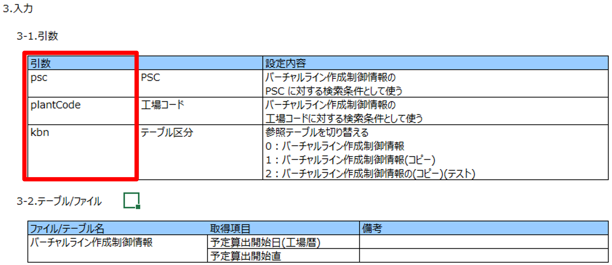
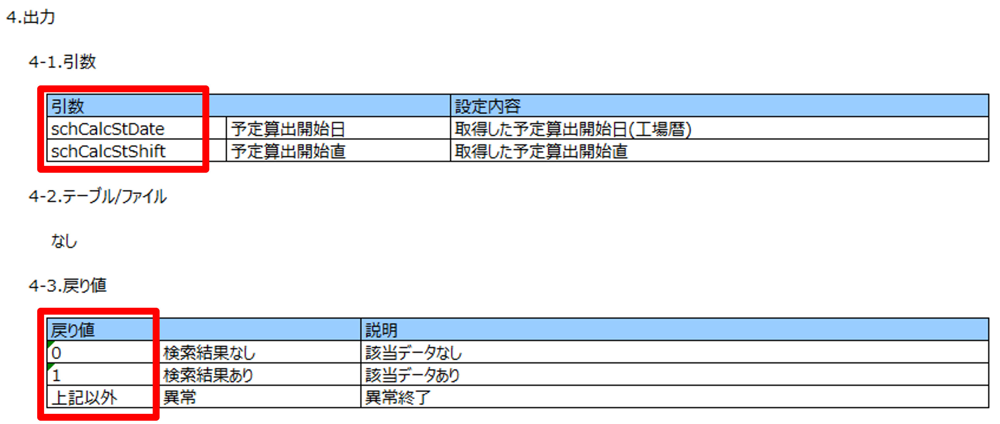

# サブプログラム説明書（処理仕様）生成用プロンプトテンプレート

## 更新情報

| バージョン | 日付 | 内容 |
| :--- | :--- | :--- |
| v0.01.00 | 2025/07/25 | 新規作成 |
| v0.02.00 | 2025/08/08 | 課題No.6　処理詳細の手順が生成されないよう改善 |
| v1.00.00 | 2025/08/22 | プログラム指示書生成機能の本番リリースのためv1.00.00に更新。 |
| 02.00.00 | 2025/11/11 | 既存のプロンプトをSystemPromptとUserPromptに分割。|

## 生成対象

赤枠箇所が生成対象。







## プロンプトテンプレートに当てはめる値の抜粋条件

| 変数 | 抜粋条件 |
|:-----------|:------------|
| code | ソースコードを関数単位で入力する。 |

### code の入力例

```(txt)
/*
 * Function name : KACgetSchCalcStDateAndShiftImpl
 * Description
 *  予定算出開始日・直取得
 * Parameters
 *  pgmStr      (I) : 呼出元のプログラムID
 *  funcStr     (I) : 呼出元の関数名
 *  labelInt    (I) : 呼出元の行番号
 *  psc         (I) : PSC
 *  plantCode   (I) : 工場コード
 *  kbn         (I) : テーブル区分
 *  stDate      (O) : 予定算出開始日
 *  stShift     (O) : 予定算出開始直
 * Return values
 *  0                : 検索結果なし
 *  1                : 検索結果あり
 *  KAX_ABNORMAL_END : 異常終了
*/
long KACgetSchCalcStDateAndShiftImpl(const char*  pgmStr,
                                     const char*  funcStr,
                                     unsigned int labelInt,
                                     char*        psc,
                                     char*        plantCode,
                                     long         kbn,
                                     char*        stDate,
                                     char*        stShift)
{
    KAYdebugLog("start");

    /* ローカル変数を宣言 */
    long rc = KAX_NORMAL_END;                        /* 戻り値                 */
    long rc_func = 0;                                /* 関数戻り値             */
    char plncalcstpdate[LEN_KA_PLNCALCSTPDATE + 1];  /* 予定算出開始日(工場暦) */
    char plncalcstpsh[LEN_KA_PLNCALCSTPSH + 1];      /* 予定算出開始直         */

    /* 変数を初期化する。 */
    memset(plncalcstpdate, 0x00, sizeof(plncalcstpdate));
    memset(plncalcstpsh,   0x00, sizeof(plncalcstpsh));

    do {
        /* 引数チェック(テーブル区分) */
        if ((kbn < 0) || (kbn > 2))
        {
            /* パラメータ異常ログ出力 */
            KAYerrorLogImpl(pgmStr, funcStr, labelInt, MSGID_ERR_PARAM,
                            "KACgetSchCalcStDateAndShift() Out of scope category!");

            /* 戻り値に"異常"を設定 */
            rc = KAX_ABNORMAL_END;

            /* ループを抜ける */
            break;
        }
        else
        {
            /* 処理なし */
        }

        /* テーブル区分が0の場合 */
        if (kbn == TBL_KBN_MASTER)
        {
            /* 「バーチャルライン作成制御情報取得」処理を呼び出す */
            rc_func = getM1240(pgmStr,
                               funcStr,
                               labelInt,
                               psc,
                               plantCode,
                               plncalcstpdate,
                               plncalcstpsh);
        }
        else if (kbn == TBL_KBN_COPY)
        {
            /* 「バーチャルライン作成制御情報(コピー)取得」処理を呼び出す */
            rc_func = getW0490(pgmStr,
                               funcStr,
                               labelInt,
                               psc,
                               plantCode,
                               plncalcstpdate,
                               plncalcstpsh);
        }
        else
        {
            /* 「バーチャルライン作成制御情報(コピー)(テスト)取得」処理を呼び出す */
            rc_func = getW0491(pgmStr,
                               funcStr,
                               labelInt,
                               psc,
                               plantCode,
                               plncalcstpdate,
                               plncalcstpsh);
        }

        /* 関数戻り値判定 */
        if ((rc_func != 0) && (rc_func != 1))
        {
            /* 戻り値に"異常"を設定 */
            rc = KAX_ABNORMAL_END;
        }
        else if (rc_func == 0)
        {
            /* 戻り値に"検索結果なし"を設定 */
            rc = 0;
        }
        else
        {
            /* 戻り値に"検索結果あり"を設定 */
            rc = 1;

            /* 取得結果を引数に設定する */
            memcpy(stDate, plncalcstpdate, LEN_KA_PLNCALCSTPDATE);
            memcpy(stShift, plncalcstpsh, LEN_KA_PLNCALCSTPSH);
        }

    } while(0);


    return rc;
}
```

## 生成結果のチェック観点

- 出力例の形式で出ているか。

### 注意事項

- インプットに日本語を含むコメント（日本語での項目名、戻り値の条件など）が記載されている場合は、生成結果にコメントの内容が反映されます。コメントがない場合は、生成結果に反映されない場合があるため、ご自身で生成結果を修正してください。

## 生成例

実プロンプト・生成結果は、[こちら](https://t365cs.sharepoint.com/:f:/r/sites/Guest-Tms-1147/Shared%20Documents/%E7%B6%AD%E6%8C%81%E3%83%BB%E6%94%B9%E5%96%84%E3%83%81%E3%83%BC%E3%83%A0/06_%E3%83%97%E3%83%AD%E3%83%B3%E3%83%97%E3%83%88%E6%94%B9%E5%96%84/%E3%83%97%E3%83%AD%E3%83%B3%E3%83%97%E3%83%88%E5%AE%9F%E8%A1%8C%E7%B5%90%E6%9E%9C/C/%E3%82%B5%E3%83%96%E3%83%97%E3%83%AD%E3%82%B0%E3%83%A9%E3%83%A0%20CALL%E8%AA%AC%E6%98%8E%E6%9B%B8?csf=1&web=1&e=QrH1Wo)に格納している。

```(txt)
### KACgetSchCalcStDateAndShiftImpl
- パラメータ：
  - const char* pgmStr : 呼出元のプログラムID
  - const char* funcStr : 呼出元の関数名
  - unsigned int labelInt : 呼出元の行番号
  - char* psc : PSC
  - char* plantCode : 工場コード
  - long kbn : テーブル区分
  - char* stDate : 予定算出開始日
  - char* stShift : 予定算出開始直
- 戻り値：
  - 0 : 検索結果なし
  - 1 : 検索結果あり
  - KAX_ABNORMAL_END : 異常終了
- 型： long
```
