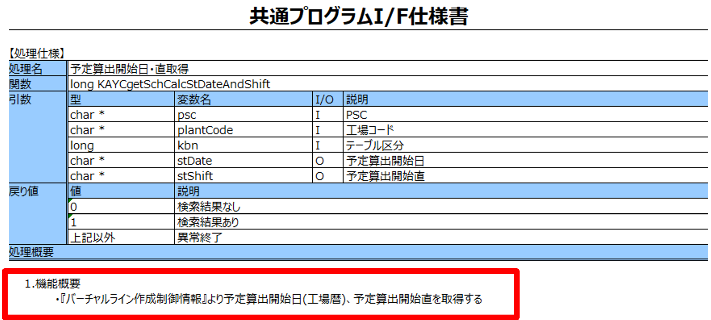

# サブプログラム説明書（概要）生成用プロンプトテンプレート

## 更新情報

| バージョン | 日付 | 内容 |
| :--- | :--- | :--- |
| v0.01.00 | 2025/07/25 | 新規作成 |
| v1.00.00 | 2025/08/22 | プログラム指示書生成機能の本番リリースのためv1.00.00に更新。 |
| 02.00.00 | 2025/11/11 | 既存のプロンプトをSystemPromptとUserPromptに分割。|

## 生成対象



## プロンプトテンプレートに当てはめる値の抜粋条件

| 変数 | 抜粋条件 |
|:-----------|:------------|
| code | ソースコードをそのまま入力する。 |


### code の入力例

```(txt)
/*
 * Project name : G-ALC
 * Program ID   : PKAC901
 * Process Name : Cブロックバッチ共通関数
 * Author       : TS)T.Fujita
 * Create Date  : 2021/09/01
 * Version    Modified date  Name            Details
 * 01.00.00   2021/09/01     TS)T.Fujita     New Creation
 *
 * Functions
 *  Function name                   : Description
 *  KACgetSchCalcStDateAndShiftImpl : 予定算出開始日・直取得
 *  getM1240                        : バーチャルライン作成制御情報取得
 *  getW0490                        : バーチャルライン作成制御情報(コピー)取得
 *  getW0491                        : バーチャルライン作成制御情報(コピー)(テスト)取得
 *
 * All Rights Reserved. Copyright 2022 (C) TOYOTA MOTOR CORPORATION. 
*/

/*------------------------------------------------------------*/
/* ヘッダーファイル定義                                       */
/*------------------------------------------------------------*/
#include <stdlib.h>
#include <string.h>
#include <stdio.h>
EXEC SQL INCLUDE SQLCA;

#include "PKAY500.h"
#include "PKAY520.h"
#include "PKAX900.h"
#include "PKAC901.h"

/*------------------------------------------------------------*/
/* グローバル変数定義                                         */
/*------------------------------------------------------------*/
/* メッセージ付加情報 */
static char KAYaddInfo[LEN_KA_ADDINFO + 1];

/* Copyright */
static const char copyRight[] = "All Rights Reserved. Copyright 2022 (C) " \
                                "TOYOTA MOTOR CORPORATION.";
/* Version */
static const char src_version[] = "01.00.00";

/*------------------------------------------------------------*/
/* 関数プロトタイプ宣言                                       */
/*------------------------------------------------------------*/
static long getM1240(const char*  pgmStr,
                     const char*  funcStr,
                     unsigned int labelInt,
                     char*        psc,
                     char*        plantCode,
                     char*        stDate,
                     char*        stShift);

static long getW0490(const char*  pgmStr,
                     const char*  funcStr,
                     unsigned int labelInt,
                     char*        psc,
                     char*        plantCode,
                     char*        stDate,
                     char*        stShift);

static long getW0491(const char*  pgmStr,
                     const char*  funcStr,
                     unsigned int labelInt,
                     char*        psc,
                     char*        plantCode,
                     char*        stDate,
                     char*        stShift);


/*
 * Function name : KACgetSchCalcStDateAndShiftImpl
 * Description
 *  予定算出開始日・直取得
 * Parameters
 *  pgmStr      (I) : 呼出元のプログラムID
 *  funcStr     (I) : 呼出元の関数名
 *  labelInt    (I) : 呼出元の行番号
 *  psc         (I) : PSC
 *  plantCode   (I) : 工場コード
 *  kbn         (I) : テーブル区分
 *  stDate      (O) : 予定算出開始日
 *  stShift     (O) : 予定算出開始直
 * Return values
 *  0                : 検索結果なし
 *  1                : 検索結果あり
 *  KAX_ABNORMAL_END : 異常終了
*/
long KACgetSchCalcStDateAndShiftImpl(const char*  pgmStr,
                                     const char*  funcStr,
                                     unsigned int labelInt,
                                     char*        psc,
                                     char*        plantCode,
                                     long         kbn,
                                     char*        stDate,
                                     char*        stShift)
{
~~~~~~~（略）~~~~~~~~~~~~~~~~~~~~~~~~~~~~~~~~~~~~~~~~~~~~~~~
}

/*
 * Function name : getM1240
 * Description
 *  バーチャルライン作成制御情報取得
 * Parameters
 *  pgmStr      (I) : 呼出元のプログラムID
 *  funcStr     (I) : 呼出元の関数名
 *  labelInt    (I) : 呼出元の行番号
 *  psc         (I) : PSC
 *  plantCode   (I) : 工場コード
 *  stDate      (O) : 予定算出開始日
 *  stShift     (O) : 予定算出開始直
 * Return values
 *  0                : 検索結果なし
 *  1                : 検索結果あり
 *  KAX_ABNORMAL_END : 異常終了
*/
static long getM1240(const char*  pgmStr,
                     const char*  funcStr,
                     unsigned int labelInt,
                     char*        psc,
                     char*        plantCode,
                     char*        stDate,
                     char*        stShift)
{
~~~~~~~（略）~~~~~~~~~~~~~~~~~~~~~~~~~~~~~~~~~~~~~~~~~~~~~~~
}

/*
 * Function name : getW0490
 * Description
 *  バーチャルライン作成制御情報(コピー)取得
 * Parameters
 *  pgmStr      (I) : 呼出元のプログラムID
 *  funcStr     (I) : 呼出元の関数名
 *  labelInt    (I) : 呼出元の行番号
 *  psc         (I) : PSC
 *  plantCode   (I) : 工場コード
 *  stDate      (O) : 予定算出開始日
 *  stShift     (O) : 予定算出開始直
 * Return values
 *  0                : 検索結果なし
 *  1                : 検索結果あり
 *  KAX_ABNORMAL_END : 異常終了
*/
static long getW0490(const char*  pgmStr,
                     const char*  funcStr,
                     unsigned int labelInt,
                     char*        psc,
                     char*        plantCode,
                     char*        stDate,
                     char*        stShift)
{
~~~~~~~（略）~~~~~~~~~~~~~~~~~~~~~~~~~~~~~~~~~~~~~~~~~~~~~~~
}

/*
 * Function name : getW0491
 * Description
 *  バーチャルライン作成制御情報(コピー)(テスト)取得
 * Parameters
 *  pgmStr      (I) : 呼出元のプログラムID
 *  funcStr     (I) : 呼出元の関数名
 *  labelInt    (I) : 呼出元の行番号
 *  psc         (I) : PSC
 *  plantCode   (I) : 工場コード
 *  stDate      (O) : 予定算出開始日
 *  stShift     (O) : 予定算出開始直
 * Return values
 *  0                : 検索結果なし
 *  1                : 検索結果あり
 *  KAX_ABNORMAL_END : 異常終了
*/
static long getW0491(const char*  pgmStr,
                     const char*  funcStr,
                     unsigned int labelInt,
                     char*        psc,
                     char*        plantCode,
                     char*        stDate,
                     char*        stShift)
{
~~~~~~~（略）~~~~~~~~~~~~~~~~~~~~~~~~~~~~~~~~~~~~~~~~~~~~~~~
}
```

## 生成結果のチェック観点

- 指定した文字数以内で出ているか。

### 注意事項

- インプットに日本語を含むコメント（日本語でのDB名やファイル名、項目名など）が記載されている場合は、生成結果にコメントの内容が反映されます。コメントがない場合は、生成結果に反映されない場合があるため、ご自身で生成結果を修正してください。

## 生成例

実プロンプト・生成結果は、[こちら](https://t365cs.sharepoint.com/:f:/r/sites/Guest-Tms-1147/Shared%20Documents/%E7%B6%AD%E6%8C%81%E3%83%BB%E6%94%B9%E5%96%84%E3%83%81%E3%83%BC%E3%83%A0/06_%E3%83%97%E3%83%AD%E3%83%B3%E3%83%97%E3%83%88%E6%94%B9%E5%96%84/%E3%83%97%E3%83%AD%E3%83%B3%E3%83%97%E3%83%88%E5%AE%9F%E8%A1%8C%E7%B5%90%E6%9E%9C/C/%E3%83%97%E3%83%AD%E3%82%B0%E3%83%A9%E3%83%A0%E6%A6%82%E8%A6%81%E8%AA%AC%E6%98%8E%E6%9B%B8?csf=1&web=1&e=SOc1DK)に格納している。

```(txt)
OUTPUT :
このCプログラムは、トヨタ自動車のCブロックバッチ共通関数を提供するものです。主な機能は、予定算出開始日と直取得を行う「KACgetSchCalcStDateAndShiftImpl」関数と、バーチャルライン作成制御情報を取得する「getM1240」、「getW0490」、「getW0491」の3つの関数です。これらの関数は、データベースから情報を取得し、エラーハンドリングやログ出力を行います。プログラムは2021年9月1日に作成され、著作権はトヨタ自動車に帰属します。
```
