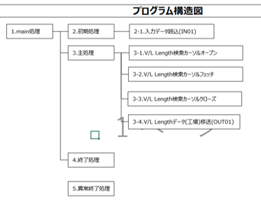

# プログラム構造図生成用プロンプトテンプレート

## 更新情報

| バージョン | 日付 | 内容 |
| :--- | :--- | :--- |
| v0.01.00 | 2025/07/25 | 新規作成 |
| v1.00.00 | 2025/08/22 | プログラム指示書生成機能の本番リリースのためv1.00.00に更新。 |
| 02.00.00 | 2025/11/11 | 既存のプロンプトをSystemPromptとUserPromptに分割。|

## 生成対象



## プロンプトテンプレートに当てはめる値の抜粋条件

| 変数 | 抜粋条件 |
|:-----------|:------------|
| code | パーサー無の場合：PGMのソースコード全体を入力する。<br>※約5000行を超えるソースコードの場合、生成精度が著しく落ちる、または生成結果が途中で途切れる可能性がある<br>パーサー有の場合：ソースコード内の関数定義と関数呼び出し部分のみを抜粋して入力する。<br>※検証時の抜粋用プログラムは[こちら](https://ibm.box.com/s/1xnj0j2f5immsdizxn280f9ufwdt3z5o)に格納している。 |
| process_list | 関数名の物理名論理名対応表を入力する。<br>※ 入力しない場合、AIが推論した名前が出力される。 |

### code の入力例

```(txt)
/*
 * Project name : G-ALC
 * Paradigm     : P2:DB抽出(FETCH)
 * Program ID   : PKAE204
 * Process Name : VL Lengthデータ作成(工場)
 * Author       : TISA)T.Yokotani
 * Create Date  : 2021/07/06
 * Version    Modified date  Name            Details
 * 01.00.00   2021/07/06     TISA)T.Yokotani 新規作成
 *
 * Functions
 *  Funciton name :  Description
 *  main                : main処理
 *  initialize          : 初期処理
 *  process             : 主処理
 *  terminate           : 終了処理
 *  abend               : 異常終了処理
 *  readIn01            : 入力データ読込(IN01)
 *  setKey01            : 抽出条件設定(TBL01)
 *  openCsr01           : 検索カーソルオープン(TBL01)
 *  fetchCsr01          : 検索カーソルフェッチ(TBL01)
 *  closeCsr01          : 検索カーソルクローズ(TBL01)
 *  setOut01            : データ移送(OUT01)
 * Copyright(C) 2022- TOYOTA Motor Corporation. All Rights Reserved.
*/

/*------------------------------------------------------------*/
/* ヘッダーファイル定義                                       */
/*------------------------------------------------------------*/
#include <stdlib.h>
#include <string.h>
#include <stdio.h>
EXEC SQL INCLUDE SQLCA;
#include "PKAY500.h"

/* ###### アプリ ヘッダー定義 Start               ######[P2.01S]Ver.1.0.0 */
#include "PKAE204.h"
#include "DKAY900.h"
#include "DKAY901.h"
#include "DKAY902.h"
#include "DKAE01040102.h"
#include "CZD04MSGTBL.h"
#include "CKA01M0720.h"
/* ###### アプリ ヘッダー定義 End                 ######[P2.01E]Ver.1.0.0 */

/*------------------------------------------------------------*/
/* グローバル変数定義                                         */
/*------------------------------------------------------------*/

/* GSCMFWコンテキスト構造体 */
static PZS1111_CTX  KAYctx;

/* プログラム終了コード(正常時) */
static int  KAYrc = KAY_OK;

/* 入力データファイル用変数 */
static char KAYpsc    [LEN_KA_PSC     + 1];         /* PSC                     */
static char KAYplant  [LEN_KA_PLANT   + 1];         /* 工場コード              */
static char KAYjparam [LEN_KA_JPARAM  + 1];         /* JOB内ユニークパラメータ */

/* メッセージ付加情報 */
static char KAYaddInfo[LEN_KA_ADDINFO + 1];

/* ###### アプリ 変数定義 Start                   ######[P2.02S]Ver.1.0.0 */

/* Copyright */
static const char copyRight[] = "All Rights Reserved. Copyright 2022 (C) " \
                                "TOYOTA MOTOR CORPORATION.";
/* Version */
static const char src_version[] = "01.00.00";

/* ファイル記述子 */
static FILE *KAYfpIn01  = NULL;
static FILE *KAYfpOut01 = NULL;

/* ファイル構造体 */
static DKAY900        KAYin01;                          /* ファイル構造体(IN01)         */
static DKAE01040102   KAYout01;                         /* ファイル構造体(OUT01)        */


/* テーブル構造体 */
static CKA01M0720 KAYtbl01;                         /* テーブル構造体(TBL01) */

/* ###### アプリ 変数定義 End                     ######[P2.02E]Ver.1.0.0 */

/*
 * Function name : main
 * Description
 *  main処理
 * Parameters
 *  argc (I) : コマンドライン引数の数
 *  argv (I) : コマンドライン引数の配列
 * Return values
 *  KAY_OK   : 正常終了
*/
int main(int argc, char* argv[])
{
    KAYdebugLog("start");
    
    /* 1.「初期処理」を呼び出す。 */
    initialize(argc, argv);
    /* 2.「主処理」を呼び出す。 */
    process();
    /* 3.「終了処理」を呼び出す。 */
    terminate();
    
    /* 4.呼び出し元にプログラム終了コードを返却する。 */
    KAYdebugLog("end");
    return KAYrc;
}

/*
 * Function name : initialize
 * Description
 *  初期処理
 * Parameters
 *  argc (I) : コマンドライン引数の数
 *  argv (I) : コマンドライン引数の配列
 * Return values
 *  N/A
*/
static void initialize(int argc, char* argv[])
{
    KAYdebugLog("start");
    /* 1.変数を初期化する。 */
    memset(&KAYctx,    0, sizeof(KAYctx));
    memset(KAYaddInfo, 0, sizeof(KAYaddInfo));
    /* 2.「共通前処理」を呼び出す。 */
    KAYbefore(&KAYctx, abend, argc, argv);

/* ###### アプリ 処理記述 Start                   ######[P2.03S]Ver.1.0.0 */
    
    /* 3.ファイルをオープンする。 */
    KAYfpIn01  = KAYfopen(KAY_IN01,  KAY_MODE_READ,  KAY_ERR_ABEND);
    KAYfpOut01 = KAYfopen(KAY_OUT01, KAY_MODE_WRITE, KAY_ERR_ABEND);
    
/* ###### アプリ 処理記述 End                     ######[P2.03E]Ver.1.0.0 */

    /* 4.「入力データ読込(IN01)」を呼び出す。 */
    readIn01();
    /* 5.「DB接続処理」を呼び出す。 */
    KAYconnect(KAYpsc, KAYplant);
    /* 6.「ジョブステータスSTEP開始更新処理」を呼び出す。 */
    KAYstepStart(KAYjparam);
    /* 7.呼び出し元に戻る。 */
    KAYdebugLog("end");
    return;
}

/*
 * Function name : process
 * Description
 *  主処理
 * Parameters
 *  N/A
 * Return values
 *  N/A
*/
static void process(void)
{
    KAYdebugLog("start");
    
/* ###### アプリ 処理記述 Start                   ######[P2.04S]Ver.1.0.0 */

    /* 1.「V/L Length検索検索カーソルオープン」を呼び出す。 */
    openCsr01();

    /* 2.「V/L Length検索検索カーソルフェッチ」の戻り値が0になるまでループする。 */
    while(fetchCsr01() != 0) {
        /* 2-1.「V/L Lengthデータ(工場)移送(OUT01)」を呼び出す。 */
        setOut01();

        //gdb:STE04: break =lnum=;run;print KAYfpOut01=NULL;cont

        /* 2-2.OUT01を出力する。 */
        KAYfwrite(&KAYout01, sizeof(KAYout01), 1, KAYfpOut01, KAY_ERR_ABEND);
    }
    /* 4-4.「検索カーソルクローズ(TBL01)」を呼び出す。 */
    closeCsr01();
/* ###### アプリ 処理記述 End                     ######[P2.04E]Ver.1.0.0 */
    
    /* 5.呼び出し元に戻る。 */
    KAYdebugLog("end");
    return;
}

/*
 * Function name : terminate
 * Description
 *  終了処理
 * Parameters
 *  N/A
 * Return values
 *  N/A
*/
static void terminate(void)
{
    KAYdebugLog("start");

/* ###### アプリ 処理記述 Start                   ######[P2.05S]Ver.1.0.0 */

    /* 1.ファイルをクローズする。 */
    KAYfclose(KAYfpIn01,  KAY_ERR_ABEND);
    KAYfclose(KAYfpOut01, KAY_ERR_ABEND);
    
    /* 2.「コミット処理」を呼び出す。 */
    KAYcommit(KAY_ERR_ABEND);

/* ###### アプリ 処理記述 End                     ######[P2.05E]Ver.1.0.0 */

    /* 3.「ジョブステータスSTEP終了更新処理」を呼び出す。 */
    KAYstepEnd(KAY_OK);
    /* 4.「DB切断処理」を呼び出す。 */
    KAYdisconnect();
    /* 5.「共通後処理」を呼び出す。 */
    KAYafter();
    /* 6.呼び出し元に戻る。 */
    KAYdebugLog("end");
    return;
}

/*
 * function Name : abend
 * Description
 *  異常終了処理
 * Parameters
 *  N/A
 * Return values
 *  N/A
*/
static void abend(void)
{
    KAYdebugLog("start");

/* ###### アプリ 処理記述 Start                   ######[P2.06S]Ver.1.0.0 */

    /* 1.ファイルをクローズする。 */
    KAYfclose(KAYfpIn01,  KAY_ERR_RETURN);
    KAYfclose(KAYfpOut01, KAY_ERR_RETURN);
    
    /* 2.「ロールバック処理」を呼び出す。 */
    KAYrollback(KAY_ERR_RETURN);

/* ###### アプリ 処理記述 End                     ######[P2.06E]Ver.1.0.0 */

    /* 3.「ジョブステータスSTEP終了更新処理」を呼び出す。 */
    KAYstepEnd(KAY_ABEND);
    /* 4.「DB切断処理」を呼び出す。 */
    KAYdisconnect();
    /* 5.「共通異常終了処理」を呼び出す。 */
    KAYabend();
    /* ※内部でexitしているため、ここで実行終了 */
    KAYdebugLog("end");
}

/*
 * Function name : readIn01
 * Description
 *  入力データ読込(IN01)
 * Parameters
 *  N/A
 * Return values
 *  N/A
*/
static void readIn01(void)
{
    KAYdebugLog("start");

    /* 1.ローカル変数を宣言する。 */
    size_t cnt = 0;                       /* IN01読み込み件数 */
    /* 2.変数を初期化する。 */
    memset(&KAYin01,  0, sizeof(KAYin01));
    memset(KAYpsc,    0, sizeof(KAYpsc));
    memset(KAYplant,  0, sizeof(KAYplant));
    memset(KAYjparam, 0, sizeof(KAYjparam));

    /* 3.入力データ(IN01)を読み込む。 */
    cnt = KAYfread(&KAYin01, sizeof(KAYin01), 1, KAYfpIn01, KAY_ERR_ABEND);
    
    /* 4A.IN01読込件数が0の場合 */
    if (cnt == 0) {
        /* 4A-1.「エラーログ出力処理」を呼び出す。 */
        KAYerrorLog(KAY_MSG_INDATA, "");
        /* 4A-2.「異常終了処理」を呼び出す。 */
        abend();
    }
    
    /* 5.入力データファイル用変数を設定する。 */
    strncpy(KAYpsc,    KAYin01.psc,    LEN_KA_PSC);
    strncpy(KAYplant,  KAYin01.plant,  LEN_KA_PLANT);
    strncpy(KAYjparam, KAYin01.jparam, LEN_KA_JPARAM);
    
    /* 6.呼び出し元に戻る。 */
    KAYdebugLog("end");
    return;
}

/*
 * Function name : openCsr01
 * Description
 *  V/L Length検索カーソルオープン
 * Parameters
 *  N/A
 * Return values
 *  N/A
*/
static void openCsr01(void)
{
    KAYdebugLog("start");
    
/* ###### アプリ 処理記述 Start                   ######[P2.07S]Ver.1.0.0 */

    /* 1.カーソルを宣言する。 */
    EXEC SQL DECLARE CSR01 CURSOR FOR
        SELECT /* 01-04-01-S001 */
               IDLINE
             , MAX(VLDAYS)
          FROM CKA01M0720
         GROUP BY IDLINE
    ;
/* ###### アプリ 処理記述 End                     ######[P2.07E]Ver.1.0.0 */

    /* 2.カーソルをオープンする。 */
    EXEC SQL OPEN CSR01;

    //gdb:STE03: break =lnum=;run;print sqlca.sqlcode=-1201;cont

	/* 3.「SQL実行結果チェック処理」を呼び出す。 */
    KAYcheckSql(&sqlca, KAY_SQL_S001, KAY_SQL_OPEN, KAY_CSR01, KAY_ERR_ABEND);
    
    /* 4.呼び出し元に戻る。 */
    KAYdebugLog("end");
    return;
}

/*
 * Function name : fetchCsr01
 * Description
 *  V/L Length検索カーソルフェッチ
 * Parameters
 *  N/A
 * Return values
 *  0 : 検索結果なし
 *  1 : 検索結果あり
*/
static long fetchCsr01(void)
{
    KAYdebugLog("start");
    /* 1.ローカル変数を宣言する。 */
    long rc = 0;                        /* 戻り値 */
    
/* ###### アプリ 処理記述 Start                   ######[P2.08S]Ver.1.0.0 */

    /* 2.変数を初期化する。 */
    memset(&KAYtbl01,  0, sizeof(KAYtbl01));

    /* 3.カーソルをフェッチする。 */
    EXEC SQL FETCH CSR01 INTO
          :KAYtbl01.idline,
          :KAYtbl01.vldays
    ;
/* ###### アプリ 処理記述 End                     ######[P2.08E]Ver.1.0.0 */

    //gdb:STE05: break =lnum=;run;print sqlca.sqlcode=-1201;cont


    /* 4A.SQLCODEがNOT FOUNDの場合 */
    if (sqlca.sqlcode == KAY_SQL_NOTFOUND) {
        /* 4A-1.戻り値に0を代入する。 */
        rc = 0;
    }
    /* 4B.上記以外の場合 */
    else {
        /* 4B-1.「SQL実行結果チェック処理」を呼び出す。 */
        KAYcheckSql(&sqlca, KAY_SQL_S001, KAY_SQL_FETCH, KAY_CSR01, KAY_ERR_ABEND);
        /* 4B-2.戻り値に1を代入する。 */
        rc = 1;
    }
    /* 5.呼び出し元に戻り値を返却する。 */
    KAYdebugLog("end");
    return rc;
}

/*
 * Function name : closeCsr01
 * Description
 *  V/L Length検索カーソルクローズ
 * Parameters
 *  N/A
 * Return values
 *  N/A
*/
static void closeCsr01(void)
{
    KAYdebugLog("start");
    
    /* 1.カーソルをクローズする。 */
    EXEC SQL CLOSE CSR01;

    //gdb:STE06: break =lnum=;run;print sqlca.sqlcode=-1201;cont

    /* 2.「SQL実行結果チェック処理」を呼び出す。 */
    KAYcheckSql(&sqlca, KAY_SQL_S001, KAY_SQL_CLOSE, KAY_CSR01, KAY_ERR_ABEND);
    
    /* 3.呼び出し元に戻る。 */
    KAYdebugLog("end");
    return;
}

/*
 * Function name : setOut01
 * Description
 *  V/L Lengthデータ(工場)移送(OUT01)
 * Parameters
 *  N/A
 * Return values
 *  N/A
*/
static void setOut01(void)
{
    KAYdebugLog("start");
    
/* ###### アプリ 処理記述 Start                   ######[P2.10S]Ver.1.0.0 */

    /* 1.変数を初期化する。 */
    memset(&KAYout01, 0, sizeof(KAYout01));
    /* 2.ファイル構造体(OUT01)へデータ移送する。 */
    strncpy(KAYout01.plantcode,  KAYplant,        LEN_KA_PLANT);
    strncpy(KAYout01.idline,     KAYtbl01.idline, LEN_KA_IDLINE);
    strncpy(KAYout01.vldays,     KAYtbl01.vldays, LEN_KA_VLDAYS);
    /* 3.ファイル構造体(OUT01)へ改行コードを設定する。 */
    KAYout01.newlinecd[0] = KAY_LF;
    
/* ###### アプリ 処理記述 End                     ######[P2.10E]Ver.1.0.0 */

    /* 4.呼び出し元に戻る。 */
    KAYdebugLog("end");
    return;
}
/* ###### アプリ 関数記述 End                     ######[P2.11E]Ver.1.0.0 */
```

### process_list の入力例

```(txt)
| 物理名 | 論理名 |
| main | main処理 |
| initialize | 初期処理 |
```

## 生成結果のチェック観点

- 出力例の形式で出ているか。
- @endwbsまで出力されているか。

### 注意事項

- ソースコード量が多い（約5000行目安）場合、生成精度が著しく落ちる、または生成結果が途中で途切れる可能性があります。手作業で約5000行未満に削減できそうなソースコード量の場合、以下箇所を削除することで生成精度が高くなる可能性があります。
 - ファイルヘッダコメント
 - ヘッダファイル定義
 - グローバル変数定義
 - 各関数ヘッダコメント
- 出力結果をPlantUMLで描画するには、以下の手順を実施してください。
1. 出力結果を拡張子.pumlに設定して保存
2. 作成した.pumlファイルをPlantUMLで描画
- PlantUMLの使い方
 - 「TG4X_手順書_04補足_C_PGM指示書生成」の「プログラム構造図」シート参照


## 生成例

実プロンプト・生成結果は、[こちら](https://t365cs.sharepoint.com/:f:/r/sites/Guest-Tms-1147/Shared%20Documents/%E7%B6%AD%E6%8C%81%E3%83%BB%E6%94%B9%E5%96%84%E3%83%81%E3%83%BC%E3%83%A0/06_%E3%83%97%E3%83%AD%E3%83%B3%E3%83%97%E3%83%88%E6%94%B9%E5%96%84/%E3%83%97%E3%83%AD%E3%83%B3%E3%83%97%E3%83%88%E5%AE%9F%E8%A1%8C%E7%B5%90%E6%9E%9C/C/%E3%83%97%E3%83%AD%E3%82%B0%E3%83%A9%E3%83%A0%E6%A7%8B%E9%80%A0%E5%9B%B3?csf=1&web=1&e=r1yoeX)に格納している。

```(txt)
OUTPUT :
@startwbs
title
構成図
end title
*:main
main処理;
**:initialize
初期処理;
***:readIn01
入力データ読込(IN01);
***:abend
異常終了処理;
**:process
主処理;
***:openCsr01
検索カーソルオープン(TBL01);
***:fetchCsr01
検索カーソルフェッチ(TBL01);
****:setOut01
データ移送(OUT01);
***:closeCsr01
検索カーソルクローズ(TBL01);
**:terminate
終了処理;
***:abend
異常終了処理;
@endwbs
```
