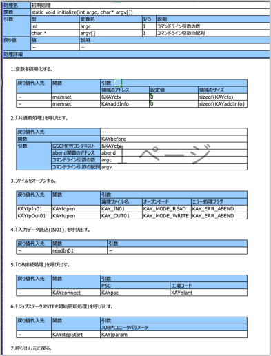

# 詳細処理説明書生成用プロンプトテンプレート

## 更新情報

| バージョン | 日付 | 内容 |
| :--- | :--- | :--- |
| v0.01.00 | 2025/07/25 | 新規作成 |
| v1.00.00 | 2025/08/22 | プログラム指示書生成機能の本番リリースのためv1.00.00に更新。 |
| 02.00.00 | 2025/11/11 | 既存のプロンプトをSystemPromptとUserPromptに分割。|

## 生成対象



## プロンプトテンプレートに当てはめる値の抜粋条件

| 変数 | 抜粋条件 |
|:-----------|:------------|
| code | ソースコードを関数単位（初期処理、主処理、終了処理など）で入力する。 |

### code の入力例

```(txt)
/*
 * Function name : initialize
 * Description
 *  初期処理
 * Parameters
 *  argc         (I) : コマンドライン引数の数
 *  argv         (I) : コマンドライン引数の配列
 * Return values
 *  KAX_NORMAL_END   : 正常終了
 *  KAX_ABNORMAL_END : 異常終了
*/
static long initialize(int argc, char* argv[])
{
    KAYdebugLog("start");

    /* ローカル変数を宣言する */
    long rc      = KAX_NORMAL_END;       /* 戻り値     */
    long rc_func = KAX_NORMAL_END;       /* 関数戻り値 */

    /* 変数を初期化する */
    memset(&KAYctx,    0x00, sizeof(KAYctx));
    memset(KAYaddInfo, 0x00, sizeof(KAYaddInfo));

    /* 以下の処理を実施する */
    do {
        /* 「共通前処理」を呼び出す */
        KAYbefore(&KAYctx,
                  abend,
                  argc,
                  argv);

        /* IN01ファイルをオープンする */
        KAYfpIn01 = KAYfopen(KAY_IN01, KAY_MODE_READ, KAY_ERR_RETURN);

        /* 関数戻り値がNULLの場合 */
        if (KAYfpIn01 == NULL) {
            /* 戻り値を設定する */
            rc = KAX_ABNORMAL_END;
            /* ループを抜ける */
            break;
        }
        /* 上記以外の場合 */
        else {
            /* 処理なし */
        }

        /* OUT01ファイルをオープンする */
        KAYfpOut01 = KAYfopen(KAY_OUT01, KAY_MODE_WRITE, KAY_ERR_RETURN);

        /* 関数戻り値がNULLの場合 */
        if (KAYfpOut01 == NULL) {
            /* 戻り値を設定する */
            rc = KAX_ABNORMAL_END;
            /* ループを抜ける */
            break;
        }
        /* 上記以外の場合 */
        else {
            /* 処理なし */
        }

        /* 「入力データ読込(IN01)」を呼び出す */
        rc_func = readIn01();

        /* 関数戻り値が正常以外の場合 */
        if (rc_func != KAX_NORMAL_END) {
            /* 戻り値を設定する */
            rc = KAX_ABNORMAL_END;
            /* ループを抜ける */
            break;
        }
        /* 上記以外の場合 */
        else {
            /* 処理なし */
        }

        /* 「DB接続処理」を呼び出す */
        KAYconnect(KAYpsc, KAYplant);

        /* 「ジョブステータスSTEP開始更新処理」を呼び出す */
        KAYstepStart(KAYjparam);

    } while (0);

    /* 呼び出し元に戻り値を返却する */
    KAYdebugLog("end");
    return rc;
}
```
## 生成結果のチェック観点

- 出力例の形式で出ているか。

### 注意事項
- ソースコードの量が多い場合、生成物の精度が下がる（引数、変数型が省略される等）可能性があります。その場合、生成対象とするソースコードの分量を関数毎に減らして、再度生成を実行してください。（プロンプト内のソースコードを編集：手順4.5を参照）


## 生成例

実プロンプト・生成結果は、[こちら](https://t365cs.sharepoint.com/:f:/r/sites/Guest-Tms-1147/Shared%20Documents/%E7%B6%AD%E6%8C%81%E3%83%BB%E6%94%B9%E5%96%84%E3%83%81%E3%83%BC%E3%83%A0/06_%E3%83%97%E3%83%AD%E3%83%B3%E3%83%97%E3%83%88%E6%94%B9%E5%96%84/%E3%83%97%E3%83%AD%E3%83%B3%E3%83%97%E3%83%88%E5%AE%9F%E8%A1%8C%E7%B5%90%E6%9E%9C/C/%E3%83%97%E3%83%AD%E3%82%B0%E3%83%A9%E3%83%A0%E4%BB%95%E6%A7%98%E6%9B%B8/%E6%8C%87%E7%A4%BA%E6%9B%B8%E7%94%9F%E6%88%90?csf=1&web=1&e=swlAkL)に格納している。

```(txt)
### initialize
- パラメータ： int argc, char* argv[]
- 戻り値： KAX_NORMAL_END（正常終了）、KAX_ABNORMAL_END（異常終了）
- 型： static long
1. KAYdebugLog("start")を呼び出す。
2. ローカル変数を宣言する。
    1. long rc = KAX_NORMAL_END（戻り値）
    2. long rc_func = KAX_NORMAL_END（関数戻り値）
3. 変数を初期化する。
    1. memset(&KAYctx, 0x00, sizeof(KAYctx))
    2. memset(KAYaddInfo, 0x00, sizeof(KAYaddInfo))
4. do...while(0)ループを実行する。
    1. KAYbefore(&KAYctx, abend, argc, argv)を呼び出す。
    2. IN01ファイルをオープンする。
        1. KAYfpIn01 = KAYfopen(KAY_IN01, KAY_MODE_READ, KAY_ERR_RETURN)
        2. 関数戻り値がNULLの場合、rcをKAX_ABNORMAL_ENDに設定し、ループを抜ける。
    3. OUT01ファイルをオープンする。
        1. KAYfpOut01 = KAYfopen(KAY_OUT01, KAY_MODE_WRITE, KAY_ERR_RETURN)
        2. 関数戻り値がNULLの場合、rcをKAX_ABNORMAL_ENDに設定し、ループを抜ける。
    4. readIn01()を呼び出す。
        1. 関数戻り値が正常以外の場合、rcをKAX_ABNORMAL_ENDに設定し、ループを抜ける。
    5. KAYconnect(KAYpsc, KAYplant)を呼び出す。
    6. KAYstepStart(KAYjparam)を呼び出す。
5. KAYdebugLog("end")を呼び出す。
6. rcを返却する。
```
